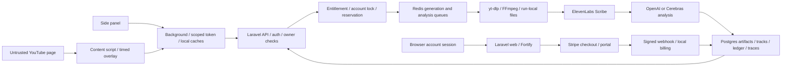

# Comprehensive application review — 2026-09-15

Repository: **C:/transcribed-subtitle-extension**. Review date: **September 15, 2026, America/Toronto**. Branch: **main**. Commit: **38015328814d5cd85b14a4cce9335463efa12b1c**. Scope includes the existing uncommitted lyrics-validation changes.

This is a review, not a repair or release approval. No implementation, dependency, environment-file, commit, deployment, real billing, email, or paid-provider changes were made. Tests used isolated databases, fake providers and notifications, and temporary browser fixtures. Existing file contents were compared with a starting SHA-256 snapshot.

## 1. Executive summary

**Address test isolation, billing correctness, session revocation, and provider-cost controls before paid-beta expansion.** The application has useful ownership, run/revision fencing, and accounting protections. Those controls do not cover several important failure and abuse paths.

The most consequential findings are:

- **R01:** the normal test command can inherit a non-test database. A disposable reproduction showed the test refresh deleting a sentinel table from that inherited database.
- **R02–R04:** three previously reported Stripe defects remain: unsupported modern period fields, a backward-moving event watermark, and multiple payable checkout sessions.
- **R05:** resetting a password revokes extension tokens but leaves existing web sessions authenticated.
- **R06–R07:** interactive AI calls lack account/provider admission, and repeated cancellation recycles minute reservations after paid work and partial output have already been delivered.
- **R09–R15:** optimization replay, SDK overload handling, Korean spacing, cached corrected tracks, Arabic token order, editing focus, and exception privacy have concrete counterexamples.

The full harness passed: **604 backend tests / 4,809 assertions**, **296 extension tests / 31 files**, contract checks, TypeScript, and the Chrome build. Separate probes exposed cases the existing suite does not establish. Dependency audits failed for backend runtime and build/development packages; the extension's production dependency audit was clean.

There is **no confirmed P0**, no demonstrated unauthenticated provider execution, cross-account track disclosure, arbitrary command execution, or arbitrary-URL SSRF in the reviewed paths. This is a bounded review, not proof that those classes of issue cannot exist.

### Priority index

Severity describes impact; confidence describes evidence. P1 requires serious financial, security, data-integrity or core-workflow impact under the stated prerequisites. P2 is a meaningful bug, reliability or operational problem. P3 is limited friction or maintenance work.

| ID | Severity | Finding | Confidence / status |
| --- | --- | --- | --- |
| R01 | P1 | Test refresh can target an inherited non-test database | High; new, environment-dependent |
| R02 | P1 | Modern Stripe period fields acknowledge payment state without access | High; known, actual deployed API version unknown |
| R03 | P1 | Delayed checkout regresses webhook ordering | High; known, reproduced |
| R04 | P1 | Superseded checkout sessions remain payable | High for lifecycle defect; actual double charge not exercised; known |
| R05 | P1 | Existing web sessions survive password reset | High; new, reproduced |
| R06 | P1 | Interactive AI work bypasses shared work limits | High; recurring scope gap, new overlap proof |
| R07 | P1 | Canceled expensive attempts recycle the minute allowance | High for behavior; product choice needed; new abuse sequence |
| R08 | P2 | Registration and reset mail lack an IP/global bound | High; new, reproduced with fake mail |
| R09 | P2 | Optimization replay rewinds or fails downstream work | High; new, reproduced |
| R10 | P2 | Real SDK overload errors are classified permanent | High; known, reproduced through installed SDK |
| R11 | P2 | Normalization removes valid Korean word spaces | High; known, reproduced |
| R12 | P2 | Cache validation discards newer corrected track content | High; new, entrypoint reproduction |
| R13 | P2 | Arabic transcript tokens appear in left-to-right order | High; browser fixture reproduction |
| R14 | P2 | An unrelated track update removes Quick Fix keyboard focus | High; browser fixture reproduction |
| R15 | P2 | Raw provider error text reaches ordinary exception stores | High for data flow; private-content impact conditional |
| R16 | P2 | Runtime diagnostics undercount active and queued work | High; known, reproduced/source-verified |
| R17 | P2 | Locked dependencies fail current release audit gates | High for installed versions/audit; reachable exploit not established |
| R18 | P3 | Current system documents contradict implemented features and policies | High; recurring |

## 2. Current system and trust boundaries

### What actually runs

The Chrome extension uses WXT and TypeScript. The side panel owns generation settings, account/history screens, transcript tools and correction input. The background worker owns API calls, scoped bearer tokens, account sessions, remembered tracks and per-tab operations. The content script detects YouTube watch/Shorts navigation, binds hidden native WebVTT, and renders an isolated overlay with local study/playback controls. Browser storage is a local cache; the account is the backend ownership boundary.

Laravel serves the marketing/account website and extension API. Fortify supplies password login/reset; Sanctum supplies scoped extension tokens. **Email verification is not implemented as the current documentation suggests:** the user model lacks MustVerifyEmail, verification features/routes are not enabled, and account summaries report emailVerified=true. Paid entitlement remains a separate gate. This is an existing policy discrepancy, not evidence of free paid access.

Generation locks the account, reuses an owner-compatible job/track or reserves minutes, then starts or queues work according to server-selected tier. Redis queues run acquisition, optimization, chunk transcription, merge, analysis and finalization. PostgreSQL stores users, billing ledger/receipts, jobs, JSON artifacts/tracks, corrections, trace events and Laravel batch metadata. SQLite is the isolated test substitute.

Acquisition uses yt-dlp metadata and public/non-live/duration checks. Upload mode downloads into a run directory; FFmpeg prepares bounded overlapping Scribe chunks. The optional direct-download path has Google media-host/protocol/header restrictions. The optional prefetch is authenticated, account/IP-limited, encrypted for 60 seconds, and disabled by default. YouTube-URL ingestion is a separately pinned mode and does not silently fall back to another paid upload.

ElevenLabs Scribe provides word timestamps. Stable completed prefixes publish source cues while later chunks run. AI analysis returns learner tokens and requested translations/readings. Only contiguous analyzed coverage advances readyThroughMs; finalization waits for the transcript and exact expected batch indexes. Current generation has **no full-track word-card mode**; cards are fetched on demand. Full lyrics replacement uses configured OpenAI/Luna, encrypted revisioned work state and parallel analysis; Quick Fix is one synchronous edited-cue request with atomic identity checks before publication.

Stripe-hosted checkout/portal and signed webhooks feed local subscription state and append-only minute events. Generation reservations settle against their original period/subscription. Completed deletion does not refund. Canceled/failed work without a track releases the reservation. Corrections/cards do not debit extra generated-video minutes.

Reference entrypoints: [background](C:/transcribed-subtitle-extension/app/extension/entrypoints/background.ts), [content](C:/transcribed-subtitle-extension/app/extension/entrypoints/content.ts), [panel](C:/transcribed-subtitle-extension/app/extension/entrypoints/sidepanel/main.ts), [API routes](C:/transcribed-subtitle-extension/app/backend/routes/api.php), [web routes](C:/transcribed-subtitle-extension/app/backend/routes/web.php), [pipeline](C:/transcribed-subtitle-extension/app/backend/app/Services/Subtitles/SubtitleGenerationPipeline.php), [ledger](C:/transcribed-subtitle-extension/app/backend/app/Services/Billing/UsageLedger.php).

### Practical threat model

| Actor / boundary | Consequential capabilities | Controls observed / remaining exposure |
| --- | --- | --- |
| Unauthenticated caller | Register accounts, request resets, probe public routes | Password/token validation, CSRF and login limits; R08 mail/account amplification |
| Authenticated malicious subscriber | Construct API requests, rotate install IDs, use multiple IPs/devices, cancel/retry | Owner checks and generation reservations hold; R06/R07 cost amplification |
| Holder of an old web session | Continue protected account requests after victim resets password | Extension tokens revoked; web session remains usable, R05 |
| Hostile page content | Influence video identity/page state, interact with injected UI | Message type/sender/page/tab validation; background owns credentials; no provider secrets in page messages |
| Untrusted media/provider output | Supply metadata, timing, text, malformed output or error messages | Canonical YouTube input, argument arrays, normalized provider output and escaped rendering; R10/R11/R15 |
| Queue duplicate / crash / stale result | Resume old payloads or return after cancellation/reset | Run IDs, batch artifacts, overlap locks and correction revisions generally hold; R09 stage replay |
| Out-of-order genuine Stripe events | Reorder local billing transitions | HMAC/receipt/subscription identity checks hold; R02–R04 lifecycle errors |
| Operator environment | Export DB/cache credentials, cache config, run release scripts | Readiness/runbook exist; R01 isolation defect and R16/R17 release/diagnostic issues |

### Reviewed versions and working tree

Installed metadata and locks agree on Laravel **13.20.0**, Laravel AI **0.6.8**, Fortify **1.37.2**, Sanctum **4.3.2**, Predis **3.5.1**, Guzzle **7.14.2**, CommonMark **2.8.3**. Tests used PHP **8.4.21**, PHPUnit **12.5.31**, WXT **0.20.27**, Vitest **4.1.10**, TypeScript **5.9.3**, Vite **8.1.4**.

The initial dirty tree contained 22 modified tracked files and one untracked completed plan:

- Backend: lyrics alignment agent, correction request/service, AppServiceProvider, bootstrap, API routes, two feature tests, and local subtitle-pipeline skill.
- Extension: side-panel DOM/HTML/main, lyrics utility and two lyrics tests.
- Contracts: lyrics request schema and generated declarations.
- Documents: ARCHITECTURE, SECURITY, RELIABILITY, lyrics spec and debt tracker; untracked completed plan for pasted-input validation.

The review includes those bytes, not merely HEAD. The new checks validate raw Unicode length/control characters before trimming, reject obvious junk/link-only input, enforce known ordered alignment references and complete pasted-part consumption, and add five replacement POSTs per account/minute. Song-match and derived-quality gates remain intentionally absent. No new defect was established in those changes.

## 3. Prioritized findings

### R01 — Test refresh can use an inherited non-test database

**Category:** operations/data integrity. **P1; high confidence. New; conditional on launch environment.**

**Location:** [check.ps1:33](C:/transcribed-subtitle-extension/scripts/agent/check.ps1:33), [phpunit.xml:21](C:/transcribed-subtitle-extension/app/backend/phpunit.xml:21), [deploy-managed-laravel.ps1:39](C:/transcribed-subtitle-extension/scripts/ops/deploy-managed-laravel.ps1:39).

**Actual versus expected:** the harness runs tests without enforcing isolated DB/cache/storage configuration. PHPUnit's APP_ENV, DB_CONNECTION, DB_DATABASE and DB_URL entries lack force=true. Exported values survive. The deploy helper calls this harness before config:clear. Tests should reject any unexpected database before migrations or side effects.

**Evidence/reproduction:** export APP_ENV=testing, DB_CONNECTION=sqlite and DB_DATABASE pointing to a disposable TEMP database containing a sentinel table and migration table. Run a temporary test with the real RefreshDatabase trait through php artisan test --compact. The configuration probe selected that file; the refresh probe reported sentinelTableSurvived=false. Only the disposable database was affected. Installed [PHPUnit handler:140](C:/transcribed-subtitle-extension/app/backend/vendor/phpunit/phpunit/src/TextUI/Configuration/PhpHandler.php:140) preserves externally set values; Collision's environment clearing does not remove externally defined variables; [RefreshDatabase:119](C:/transcribed-subtitle-extension/app/backend/vendor/laravel/framework/src/Illuminate/Foundation/Testing/RefreshDatabase.php:119) calls migrate:fresh.

**Impact and limits:** a staging/local/testing environment pointing to a shared database can lose its tables. Literal APP_ENV=production has Laravel's destructive-command confirmation, so this does **not** prove every production invocation wipes data. Cached non-production configuration can also defeat test overrides. The full review harness explicitly bypassed cached config and selected an isolated profile.

**Smallest sound repair/regression:** fail closed before test bootstrap unless the selected DB is the approved disposable database; force test environment/DB/cache/mail/queue settings and use a separate config-cache path. Run release tests in an isolated job before the deployment environment. Preserve a disposable sentinel DB outside the approved test target and verify the command refuses it unchanged. See [Laravel testing guidance](https://laravel.com/docs/13.x/testing).

### R02 — Modern Stripe periods are acknowledged without granting access

**Category:** billing/correctness. **P1; high confidence. Known unresolved September 9 F01.**

**Location:** [StripeWebhookService:216](C:/transcribed-subtitle-extension/app/backend/app/Services/Billing/StripeWebhookService.php:216), [invoice handling:248](C:/transcribed-subtitle-extension/app/backend/app/Services/Billing/StripeWebhookService.php:248), [StripeClient:254](C:/transcribed-subtitle-extension/app/backend/app/Services/Billing/StripeClient.php:254), [entitlement:195](C:/transcribed-subtitle-extension/app/backend/app/Services/Billing/BillingEntitlementService.php:195).

**Prerequisite/behavior:** REST/webhook payloads use modern item-level subscription periods. The code reads only top-level current_period_start/end and legacy invoice.subscription, while requests pin no Stripe-Version. It can mark an active subscription event processed, store status active, create no grant, and return no active plan. Existing dates can remain stale on renewal.

**Evidence:** an isolated event with periods only in items.data[0] produced active status, processed_at set, zero usage events and activePlan=null. Current Stripe documentation confirms [item-level periods](https://docs.stripe.com/changelog/basil/2025-03-31/deprecate-subscription-current-period-start-and-end) and the [changed invoice parent](https://docs.stripe.com/changelog/basil/2025-03-31/adds-new-parent-field-to-invoicing-objects). Actual deployed Stripe versions were not inspected.

**Impact:** a paying customer can have no access or renewed allowance despite successful webhook acknowledgement. No real payment was made.

**Repair/regression:** choose and pin supported REST/webhook versions together, parse their period/invoice shapes, and surface incomplete active billing state. Preserve event/grant idempotency. Exercise modern checkout retrieval, subscription update, renewal and payment failure fixtures, then an authorized Stripe test-mode flow.

### R03 — Delayed checkout regresses the webhook ordering watermark

**Category:** billing/authorization. **P1; high confidence. Known unresolved September 9 F02.**

**Location:** [checkout refresh:136](C:/transcribed-subtitle-extension/app/backend/app/Services/Billing/StripeWebhookService.php:136), [state write:231](C:/transcribed-subtitle-extension/app/backend/app/Services/Billing/StripeWebhookService.php:231), [ordering:362](C:/transcribed-subtitle-extension/app/backend/app/Services/Billing/StripeWebhookService.php:362).

**Reproduced ordering:** a canceled event at T+300 is stored. Delayed checkout at T+100 retrieves current canceled state but writes T+100 as the watermark. A stale active event at T+200 now passes. Final status and activePlan become active.

**Expected/root cause:** authoritative refresh must not move the same subscription's ordering watermark backward. The refresh uses an old event timestamp without a monotonic check.

**Impact/controls:** genuine reordered Stripe deliveries can restore canceled access. HMAC verification still holds; arbitrary callers cannot forge these events. Checkout alone does not reactivate the account in this reproduction—the third stale event does.

**Repair/regression:** make every same-subscription watermark write monotonic, with explicit handling for a genuinely new subscription identity. Test this exact three-event sequence, equal-second authoritative refresh and subscription replacement. Reconcile affected local state without duplicating grants.

### R04 — Changing plans leaves superseded checkout sessions payable

**Category:** billing lifecycle. **P1; high confidence in the defect; real duplicate charges untested. Known unresolved September 9 F03.**

**Location:** [checkout intent:190](C:/transcribed-subtitle-extension/app/backend/app/Services/Billing/StripeClient.php:190), [session creation:60](C:/transcribed-subtitle-extension/app/backend/app/Services/Billing/StripeClient.php:60), [account deletion:34](C:/transcribed-subtitle-extension/app/backend/app/Http/Controllers/AccountController.php:34).

**Prerequisite/behavior:** before a subscription webhook completes, open checkout for Base, then Plus. Same-plan intent reuse works, but a different plan replaces local session fields without expiring the previous Stripe session. Isolated fake HTTP recorded two creates, no expire call, and only the second session retained. Account deletion cancels known subscriptions, not still-open checkout sessions.

**Impact:** both tabs can remain payable; an open checkout can outlive account deletion. This creates a credible duplicate/orphan-payment path. No real double charge was performed.

**Expected/repair:** reconcile one current open checkout per customer across plan changes, concurrency and deletion. Expire superseded sessions and handle expiry/completion races explicitly before forgetting their identities. Preserve idempotency and portal routing. Regression: Base→Plus, overlapping creates, expiration failure, and account deletion with an open session; confirm hosted behavior in authorized Stripe test mode.

### R05 — Password reset leaves existing web sessions authenticated

**Category:** account security. **P1; high confidence. New.**

**Location:** [ResetUserPassword:30](C:/transcribed-subtitle-extension/app/backend/app/Actions/Fortify/ResetUserPassword.php:30), [protected web routes:47](C:/transcribed-subtitle-extension/app/backend/routes/web.php:47), [bootstrap:27](C:/transcribed-subtitle-extension/app/backend/bootstrap/app.php:27).

**Prerequisite/actual behavior:** an attacker already has a valid web session. Reset rotates the password/remember token and deletes Sanctum tokens, but protected routes have no authenticated-session password-hash check and existing sessions are not revoked. A real login followed by direct invocation of the production reset action and a fresh auth-guard request still returned dashboard HTTP 200; the old extension token was gone. A complete second-browser reset-token HTTP flow was not exercised.

**Expected/impact:** password recovery should end access established with the compromised credential/session. The old session retains history and job-deletion access and can request a billing portal. Current-password validation still protects account deletion. This does not allow a fresh login with the old password.

**Repair/regression:** invalidate existing sessions and apply Laravel authenticated-session checking across protected web routes. Handle already-issued sessions without the stored password hash during rollout. Retain a pre-reset cookie across an independent reset and assert rejection at dashboard/job/portal, alongside token/remember revocation. Verify the chosen production session driver. [Laravel authentication documentation](https://laravel.com/docs/13.x/authentication) and installed SessionGuard/AuthenticateSession were checked.

### R06 — Interactive AI work bypasses account/provider admission

**Category:** financial abuse/reliability. **P1; high confidence. Recurring September 9 F10 scope gap; new concurrent-miss proof.**

**Location:** [LearningTokenEnrichmentService:38](C:/transcribed-subtitle-extension/app/backend/app/Services/TranslationAnalysis/LearningTokenEnrichmentService.php:38), [cache:50](C:/transcribed-subtitle-extension/app/backend/app/Services/TranslationAnalysis/LearningTokenEnrichmentService.php:50), [Quick Fix provider call:279](C:/transcribed-subtitle-extension/app/backend/app/Services/Subtitles/LyricsCorrectionService.php:279), [HTTP limits:42](C:/transcribed-subtitle-extension/app/backend/app/Providers/AppServiceProvider.php:42), [queue-only limiter:55](C:/transcribed-subtitle-extension/app/backend/app/Jobs/SubtitleCueBatchJob.php:55).

**Actual/root cause:** cards and Quick Fix require active billing, but their synchronous provider calls do not acquire the account batch permit or provider-wide request budget. Cache::remember also does not serialize a concurrent miss. A misses; while its provider is suspended, B misses; B completes; A resumes. The isolated real service called the fake provider **twice for one card**. Quick Fix similarly permits several requests before a later identity check rejects stale publication.

**Impact/limits:** a subscriber with one saved track can submit expensive calls directly. Rotating install headers bypasses the default 30/install/minute bound up to the default **120 mutations/minute/IP**; multiple IPs extend it. Actual throughput depends on server/provider capacity. Owner/expiry checks hold, and successful cache hits avoid repeated work. No customer double-debit was demonstrated.

**Repair/regression:** enforce account/provider request and concurrency budgets at the actual provider boundary, including interactive and correction work; serialize identical cache misses and recheck the cache after acquiring the lock. Reject conflicting edits before paid work. Keep generated-minute pricing separate if edits remain included. Test concurrent identical cards, conflicting edits and mixed queue/interactive calls across devices. Preserve late-result and owner checks.

### R07 — Repeated expensive cancellations recycle the minute allowance

**Category:** financial abuse/accounting policy. **P1; high confidence in behavior. New explicit abuse sequence.**

**Location:** [partial response:70](C:/transcribed-subtitle-extension/app/backend/app/Http/Resources/SubtitleJobResource.php:70), [partial source:65](C:/transcribed-subtitle-extension/app/backend/app/Services/Subtitles/SubtitlePartialTrackAssembler.php:65), [cancel/refund:284](C:/transcribed-subtitle-extension/app/backend/app/Services/Subtitles/SubtitleJobService.php:284), [settlement:342](C:/transcribed-subtitle-extension/app/backend/app/Services/Billing/UsageLedger.php:342).

**Behavior/reproduction:** after transcription, all source draft cues can be returned while analysis is unfinished. A subscriber saves that response and cancels before final publication, releasing the entire reservation. A bounded synthetic 60-minute job exposed its draft through the actual resource/assembler, then cancellation changed Base allowance from 30 available/60 reserved to **90 available/0 reserved/0 used**. No 60-minute provider run occurred; fixtures prove the publication/settlement interaction.

**Impact:** repeating different videos consumes provider resources and can deliver source transcripts without reducing monthly minutes. Even cancellation before useful output can repeatedly consume paid work. Subscription, reservation, queue and HTTP controls bound simultaneous activity; none bounds accumulated canceled paid attempts.

**Policy distinction:** full refund without a completed track is documented in terms/dashboard copy. The defect is the absent abuse bound around that policy, not incorrect ledger arithmetic.

**Repair/regression:** retain reasonable early-cancellation refunds while tracking irreversible provider attempts/cost or delivered work under an account abuse allowance that survives cancellation and job deletion. Retention after account deletion needs a separate documented privacy policy. Product must choose whether partial delivery earns a minute debit. Test repeated costly cancellations eventually stop, early cancellation remains refundable, and settlement stays idempotent.

### R08 — Registration/reset mail can be amplified without an IP bound

**Category:** unauthenticated abuse. **P2; high confidence. New sequence.**

**Location:** [Fortify config:119](C:/transcribed-subtitle-extension/app/backend/config/fortify.php:119), [FortifyServiceProvider:68](C:/transcribed-subtitle-extension/app/backend/app/Providers/FortifyServiceProvider.php:68), [CreateNewUser:31](C:/transcribed-subtitle-extension/app/backend/app/Actions/Fortify/CreateNewUser.php:31), [installed Fortify routes:64](C:/transcribed-subtitle-extension/app/backend/vendor/laravel/fortify/routes/routes.php:64).

**Evidence:** one test client/IP performed seven register→logout→forgot-password sequences with unique example.test addresses. Seven accounts and seven faked ResetPassword notifications resulted without throttling. The effective routes have no register/reset IP or global limit. Login throttling and the broker's per-address resend limit exist.

**Impact:** a caller can vary target addresses to consume hashing, account/session storage and transactional mail. CSRF remains enabled, but a direct client can fetch its own form/session token. No emails were sent; inactive accounts still cannot start paid generation.

**Repair/regression:** add application-configured IP/global registration and reset-request limits while retaining per-address broker throttling and generic responses. Test varied addresses from one IP hit a bound and ordinary registration/reset remains usable. No vendor modification is needed.

### R09 — Optimization replay can rewind or fail valid downstream work

**Category:** queue correctness. **P2; high confidence. New.**

**Location:** [OptimizeSubtitleAudio:22](C:/transcribed-subtitle-extension/app/backend/app/Jobs/OptimizeSubtitleAudio.php:22), [pipeline entry:156](C:/transcribed-subtitle-extension/app/backend/app/Services/Subtitles/SubtitleGenerationPipeline.php:156), [stage write:236](C:/transcribed-subtitle-extension/app/backend/app/Services/Subtitles/SubtitleGenerationPipeline.php:236), [merge cleanup:438](C:/transcribed-subtitle-extension/app/backend/app/Services/Subtitles/SubtitleGenerationPipeline.php:438).

**Interleaving:** optimizer commits transcribing and publishes chunk jobs, then dies before acknowledgment. Other workers finish transcription/merge, move to tokenizing, and delete audio. Redelivery sees the same running run, but no expected-stage/completed-stage guard, and optimizes the deleted source.

**Evidence:** replay after the existing progressive fixture's successful merge changed tokenizing→transcribing with audioExists=false. A WebM replay with a fake missing-file FFmpeg result changed the otherwise active job to failed. Four pipeline counterexample checks include these two failures. Actual Redis worker death was not performed.

**Impact:** loss of valid work, backward progress, failed generation and repeated upstream expense. Chunk artifact guards limit duplicate uploads; do not infer unlimited duplicate transcription or double debit.

**Repair/regression:** claim/serialize optimization under the existing run/job lock, require the expected stage before work and publication, and make advanced-stage replay harmless. Preserve recovery when continuation publication was genuinely lost. Test replay during transcription, after merge and during analysis, then a disposable Redis/Postgres death-after-publish case.

### R10 — Installed SDK overload errors bypass transient retries

**Category:** provider reliability. **P2; high confidence. Known unresolved September 9 F13.**

**Location:** [AI adapter:340](C:/transcribed-subtitle-extension/app/backend/app/Services/TranslationAnalysis/LaravelAiTranslationAnalysisProvider.php:340), [fallback:389](C:/transcribed-subtitle-extension/app/backend/app/Services/TranslationAnalysis/LaravelAiTranslationAnalysisProvider.php:389), [lyrics alignment:851](C:/transcribed-subtitle-extension/app/backend/app/Services/Subtitles/LyricsCorrectionService.php:851), [SDK mapping:35](C:/transcribed-subtitle-extension/app/backend/vendor/laravel/ai/src/Gateway/Concerns/HandlesFailoverErrors.php:35).

**Actual/evidence:** HTTP fake 503 through the actual installed AI SDK produced ProviderOverloadedException. The application only handles SDK RateLimitedException and raw HTTP/connection exceptions. It returned enrichment_failed with isTransient=false. The regression expecting a temporary error failed. Both analysis and alignment adapters contain this omission.

**Impact:** temporary provider load terminates generation/correction, discards resumable work and encourages a paid retry. Existing bounded retry settings cannot help an error marked permanent.

**Repair/regression:** explicitly classify SDK overload at both boundaries using one small shared policy if useful. Preserve permanent quota/auth/validation failures. Test HTTP 503→success through the real adapter and queue wrapper, along with 429/500/connection/quota cases. Coordinate sanitization with R15; no SDK upgrade is needed for this fix.

### R11 — Korean normalization removes legitimate word spacing

**Category:** language correctness. **P2; high confidence. Known unresolved September 9 F05.**

**Location:** [NoSpaceArtifactBoundary:22](C:/transcribed-subtitle-extension/app/backend/app/Services/Text/NoSpaceArtifactBoundary.php:22), [normalizer:352](C:/transcribed-subtitle-extension/app/backend/app/Services/Transcription/ScribeTranscriptNormalizer.php:352), [token validator:68](C:/transcribed-subtitle-extension/app/backend/app/Services/TranslationAnalysis/LearningTokenOutputValidator.php:68), [Quick Fix reconstruction:251](C:/transcribed-subtitle-extension/app/backend/app/Services/Subtitles/LyricsCorrectionService.php:251).

**Actual/evidence:** Hangul is in the no-space script class. Whitespace between Hangul words is removed. Real normalization of timestamped 나는 / 학교에 / 갑니다. produced **나는학교에갑니다.** instead of **나는 학교에 갑니다.** This is deterministic source corruption, not a disputed translation judgment.

**Impact:** incorrect Korean in stored/cached cues, subtitles, copy/search and some corrections.

**Repair/regression:** preserve Korean word boundaries; retain only demonstrated artifact-space repair for appropriate scripts. Version affected caches/output. Test Korean, mixed Hangul/Latin, punctuation, Chinese/Japanese and combining marks through normalizer, tokens and Quick Fix. Representative provider output is still needed to distinguish real spaces from syllable-level artifacts.

### R12 — Saved-track validation throws away newer corrected content

**Category:** extension state correctness. **P2; high confidence. New.**

**Location:** [revalidateSavedTrack:349](C:/transcribed-subtitle-extension/app/extension/entrypoints/background.ts:349), [return old state:368](C:/transcribed-subtitle-extension/app/extension/entrypoints/background.ts:368).

**Prerequisite/behavior:** Quick Fix in another tab/device changes a saved generation's track ID/content while retaining the job ID. On page-entry revalidation, the backend returns the new track, but the background reduces that response to an available boolean and returns the cached old state. Full lyrics replacement has a separate completion-status recovery path, so Quick Fix is the clean trigger.

**Evidence:** an isolated test of the real background entrypoint returned track-old/hello world after the mocked API returned track-new/corrected text for the same completed job. This was not inferred from a helper-only test.

**Impact:** refresh/reopen can retain obsolete words and identities despite a successful server check. Later word-card/correction actions can reject the obsolete track.

**Repair/regression:** retain and publish the validated current track, under existing account/tab/operation guards; compare returned track identity/revision rather than job existence alone. The saved-history branch also needs freshness handling. Test correction on another tab/device followed by refresh, late response after account/tab change, and unchanged cached-card preservation.

### R13 — Arabic token lines are laid out left to right

**Category:** language/accessibility UX. **P2; high confidence. Browser-tested fixture. New.**

**Location:** [sourceLineHtml:104](C:/transcribed-subtitle-extension/app/extension/utils/panel/transcript.ts:104), [editable token wrapper:114](C:/transcribed-subtitle-extension/app/extension/utils/panel/transcript.ts:114), [token wrapper:134](C:/transcribed-subtitle-extension/app/extension/utils/panel/transcript.ts:134), [flex styles:945](C:/transcribed-subtitle-extension/app/extension/entrypoints/sidepanel/style.css:945).

**Steps/result:** load actual panel source with an Arabic track in a 360-pixel local fixture. Show token readings, then enter Quick Fix. The token wrapper inherits LTR direction from the English document. Source-order token left edges were أنا=69, أحب=95, الموسيقى=138: the first Arabic word is at the left. Separate token boxes prevent normal bidirectional text layout from correcting the sequence.

**Expected/impact:** preserve source-language reading order in both ordinary and editable token lines, while keeping Latin pronunciation readable. The current layout changes the sentence's visual order for RTL learners.

**Repair/regression:** derive token-line direction from source content/language and isolate token/readings appropriately; preserve logical DOM order for keyboard use. Browser-test Arabic/Hebrew, mixed digits/Latin/punctuation and Quick Fix at narrow widths. Evidence: [Arabic panel screenshot](C:/transcribed-subtitle-extension/docs/review-evidence/2026-09-15/rtl-panel.png). This is actual panel rendering with fake transport, not a live YouTube extension run.

### R14 — An unrelated update removes Quick Fix input focus

**Category:** keyboard UX. **P2; high confidence. Browser-tested fixture. New.**

**Location:** [transcript render:69](C:/transcribed-subtitle-extension/app/extension/entrypoints/sidepanel/transcript-view.ts:69), [editor hydration:98](C:/transcribed-subtitle-extension/app/extension/entrypoints/sidepanel/transcript-view.ts:98), [setData:247](C:/transcribed-subtitle-extension/app/extension/entrypoints/sidepanel/transcript-view.ts:247).

**Steps/result:** open Quick Fix, focus its input and type a draft. Simulate another cue's arriving word-card metadata, then a normal visibility refresh. setData sees a changed cue payload and rebuilds transcript innerHTML. Hydration preserves the draft but restores focus only when the one-time open flag is set. Browser activeElement changes INPUT→BODY.

**Impact:** typing and Enter/Escape operation are interrupted even though the edited cue did not change. The reproduction does **not** show lost draft text.

**Repair/regression:** preserve the focused editor and selection across unrelated updates, or update unaffected rows without rebuilding it. Do not force focus when the user has moved elsewhere. Test an interleaved metadata response while typing, preserving text, focus, selection and scroll. Evidence: [after update](C:/transcribed-subtitle-extension/docs/review-evidence/2026-09-15/focus-verified-after.png).

### R15 — Provider error bodies bypass the structured-log sanitizer

**Category:** privacy/observability. **P2; high confidence in the sink; sensitive-content impact conditional. New.**

**Location:** [AI exception chaining:389](C:/transcribed-subtitle-extension/app/backend/app/Services/TranslationAnalysis/LaravelAiTranslationAnalysisProvider.php:389), [domain exception:24](C:/transcribed-subtitle-extension/app/backend/app/Exceptions/SubtitleProcessingException.php:24), [render-only handlers:45](C:/transcribed-subtitle-extension/app/backend/bootstrap/app.php:45), [failed-job storage:62](C:/transcribed-subtitle-extension/app/backend/vendor/laravel/framework/src/Illuminate/Queue/Failed/DatabaseUuidFailedJobProvider.php:62).

**Actual/evidence:** public renderers and SubtitleWorkflowLogger redact their own output, but domain exceptions retain raw provider exceptions as previous causes. Standard Laravel reporting and failed_jobs serialization operate independently. A fake HTTP 400 with error.message containing a private-content sentinel passed through the actual SDK/adapter; report(exception) wrote the sentinel to an ordinary log, and queue.failer wrote it to failed_jobs.exception.

**Impact/limits:** if a provider echoes lyrics/transcript or other sensitive content in an error, it is stored outside the promised encrypted correction fields and can outlive correction completion/cancellation. The test proves the data path; it does not establish that a real provider echoed customer lyrics or that logs were externally disclosed.

**Repair/regression:** sanitize provider exceptions before all normal reporting and failed-job sinks, keeping class/status/request ID and retry classification. A renderer-only change is insufficient. Test secret/content sentinels through HTTP and queue failure paths, including previous exceptions, while retaining useful safe diagnostics. Laravel's [reporting behavior](https://laravel.com/docs/13.x/errors) and installed Monolog previous-cause formatting were checked.

### R16 — Runtime diagnostics undercount work

**Category:** operations/reliability. **P2; high confidence. Known unresolved September 9 F12.**

**Location:** [active query:29](C:/transcribed-subtitle-extension/app/backend/app/Console/Commands/ShowSubtitleRuntime.php:29), [count:58](C:/transcribed-subtitle-extension/app/backend/app/Console/Commands/ShowSubtitleRuntime.php:58), [Redis depth:151](C:/transcribed-subtitle-extension/app/backend/app/Console/Commands/ShowSubtitleRuntime.php:151).

**Actual/evidence:** activeJobCount counts the 25-row display sample. An isolated DB with 30 running jobs reported 25. Redis depth reads only LLEN of the ready list, excluding delayed/reserved work; the database driver counts all rows, so the meaning also differs by driver. Installed [RedisQueue:111](C:/transcribed-subtitle-extension/app/backend/vendor/laravel/framework/src/Illuminate/Queue/RedisQueue.php:111) already exposes size/pending/delayed/reserved operations.

**Impact:** alerting and incident diagnosis can show a small/empty queue while retry-delayed or reserved work remains. A bounded display list is appropriate; treating it as the total is not.

**Repair/regression:** query the true active count separately and label ready/delayed/reserved depths explicitly using the native queue APIs. Test more than 25 jobs and each Redis state in a disposable instance. Keep the detailed display bounded.

### R17 — Locked dependencies fail the current release gates

**Category:** dependencies/release operations. **P2; high confidence in audit results. Runtime exposure not established. Recurring development debt plus current backend/build blockers.**

**Location:** [Guzzle lock:948](C:/transcribed-subtitle-extension/app/backend/composer.lock:948), [CommonMark lock:1975](C:/transcribed-subtitle-extension/app/backend/composer.lock:1975), [extension lock](C:/transcribed-subtitle-extension/app/extension/package-lock.json), [contracts lock:163](C:/transcribed-subtitle-extension/packages/contracts/package-lock.json:163), [deploy audit gates:47](C:/transcribed-subtitle-extension/scripts/ops/deploy-managed-laravel.ps1:47).

**Evidence:** on the review date, composer audit --locked --no-dev returned exit 1 with **15 advisories**: Guzzle 7.14.2 has five; CommonMark 2.8.3 has ten. The contract package audit reports two high-severity affected packages, fast-uri and js-yaml. Extension full audit reports **16 affected packages: 3 critical, 7 high, 5 moderate, 1 low**; production-only audit reports zero. Package counts are not unique exploit counts.

**Exposure distinction:** backend packages are installed in runtime, but inspected HTTP calls use configured provider destinations/canonical URLs, not arbitrary user Guzzle destinations. No user Markdown parser, enabled dangerous CommonMark extension, or XML renderer was found. Thus these scans do not establish application SSRF/XSS/DoS. WXT/Vitest/runner dependencies are development/build tooling, not browser-shipped executable dependencies. The configured deployment audits nevertheless fail on these locks.

**Repair/regression:** update affected packages within supported constraints and retest; evaluate a WXT change separately instead of force-upgrading everything. Preserve strict CI/build inputs and local-only development exposure. Repeat runtime and build audits, contracts, SDK tests and release packaging. Primary advisories checked include [Guzzle host handling](https://github.com/guzzle/guzzle/security/advisories/GHSA-v5mv-p594-2x33), [CommonMark parser DoS](https://github.com/thephpleague/commonmark/security/advisories/GHSA-j8pm-gj4c-rq4x), and [Vitest mock-server file read](https://github.com/vitest-dev/vitest/security/advisories/GHSA-82fw-gwwq-j7x9). Preserve advisory-specific reachability distinctions during remediation.

### R18 — System-of-record documents describe incompatible current behavior

**Category:** maintainability/product contracts. **P3; high confidence. Recurring.**

**Location:** [architecture versions:20](C:/transcribed-subtitle-extension/ARCHITECTURE.md:20), [full cards:40](C:/transcribed-subtitle-extension/ARCHITECTURE.md:40), [product full-card promise:45](C:/transcribed-subtitle-extension/docs/product-specs/index.md:45), [security](C:/transcribed-subtitle-extension/docs/SECURITY.md), [reliability](C:/transcribed-subtitle-extension/docs/RELIABILITY.md), [actual versions:12](C:/transcribed-subtitle-extension/app/backend/app/Support/SubtitleProcessingVersion.php:12).

**Evidence/impact:** architecture still names analysis v13/transcript v3 while current constants are analysis v16/transcript chunks v6. Product/architecture prose promises optional full-track cards, but the input and jobs were removed. Other sections still describe OpenAI WebVTT STT, verification-required accounts, partial lyric merging, or selected-provider lyrics alignment despite Scribe/Luna-only/current correction behavior. The current tree itself contains conflicting paragraphs.

**Expected/repair:** current documents should identify one implemented workflow and explicitly label historical decisions. Remove obsolete promises, update versions/provider/cache boundaries, and resolve verification/grandfathering policy. Check each claim against routes/config/constants and link historic plans rather than leaving competing instructions. Do not implement removed features merely to satisfy stale prose.

## 4. Concrete abuse sequences and controls

| Sequence | Prerequisite / effort | What holds or fails | Exposure |
| --- | --- | --- | --- |
| A: repeated same-card cache miss | Active subscriber, one owned un-enriched card, two overlapping API calls | Auth/owner/publication hold; cache computation is not serialized | Two provider calls for one card reproduced; R06 |
| B: conflicting Quick Fix burst | Active subscriber, saved track, N requests before first completion | Final track identity prevents stale writes; paid calls already happened | Up to N calls for one accepted edit; exact live concurrency unmeasured; R06 |
| C: transcript extraction then cancel | Active subscriber, reservation large enough, direct polling/cancel | Same-owner output only; complete source can precede analysis completion; refund restores allowance | Repeated different-video work evades accumulated generated-minute spending; R07 |
| D: costly cancellation without output | Subscriber repeatedly cancels while requests are in flight | Run fences discard late results; providers cannot be recalled | Wasted paid work with refunded allowance; same R07 root cause |
| E: reordered Stripe delivery | Genuine delayed events for the same subscription | Signature and receipt checks hold; watermark regresses | Canceled access restored by stale update; R03 |
| F: two checkout tabs | Account without completed subscription, choose two plans | Same-plan idempotency holds; cross-plan lifecycle fails | Two open payable sessions; real charges not tested; R04 |
| G: account/reset-mail spray | Unauthenticated client with its own CSRF session; varied addresses | Broker limits one address; no varied-address IP/global bound | Seven accounts/notifications reproduced with fakes; R08 |
| H: rotate install ID for new generation | Subscriber sends concurrent requests | Account lock, owner identity, reservations and submission caps still apply | No generation-concurrency/minute bypass demonstrated merely from install rotation |
| I: fetch another account's job/track/correction | Authenticated wrong owner with valid identifier | Queries and locked publication are owner-scoped | No cross-account result or mutation demonstrated |
| J: cancel/reset then receive late worker result | Previously admitted work | Run/revision/status checks reject late publication; completed ledger settlement is idempotent | Data protection holds; in-flight provider cost remains R07 |

Queue-only analysis throttling also counts job entry, not necessarily every outbound request: malformed-output retry can issue a second request, and correction/interactive paths have different coverage. The default configuration permits 9 generation workers and 22 batch workers across priority/base-guarantee pools; this is configured capacity, not observed running processes. No measured request rate, dollar loss, or vendor quota has been inferred.

**Prompt injection:** transcripts and lyrics are untrusted data; alignment/analysis have structured output and no discovered tools for shell execution, private-data retrieval or arbitrary external actions. Injection can degrade alignment, token/translation output, or waste admitted requests. Current alignment range/identity checks restrict dropped/duplicated pasted parts. They do not prove semantic song matching. Treat this as output-integrity/cost exposure, not server compromise.

## 5. Ponytail simplification opportunities

These recommendations preserve security, run/transaction guards, diagnostics that have real callers, accessibility and failure handling. No repository-wide framework rewrite is justified.

### PT01 — delete: remove obsolete logger entrypoints and an unused failure helper

**P3; high confidence; newly verified dead code.** [SubtitleWorkflowLogger:109](C:/transcribed-subtitle-extension/app/backend/app/Services/Subtitles/SubtitleWorkflowLogger.php:109), [:150](C:/transcribed-subtitle-extension/app/backend/app/Services/Subtitles/SubtitleWorkflowLogger.php:150), [:177](C:/transcribed-subtitle-extension/app/backend/app/Services/Subtitles/SubtitleWorkflowLogger.php:177), [:203](C:/transcribed-subtitle-extension/app/backend/app/Services/Subtitles/SubtitleWorkflowLogger.php:203), and [pipeline:730](C:/transcribed-subtitle-extension/app/backend/app/Services/Subtitles/SubtitleGenerationPipeline.php:730).

The four completion/full-enrichment logger methods have no runtime callers; the two enrichment methods are called only by their direct unit test. failIncompleteState has no caller. The obsolete methods suggest removed workflow stages still run. Smallest replacement: nothing. Remove only these definitions and tests asserting obsolete events; keep active tokenization/stage/failure logs and the shared token counter. Validate callers with repository search and run focused logger/pipeline tests. Direct definitions total **58 lines**, before test cleanup.

### PT02 — delete: stop producing and carrying unused dialect metadata

**P3; high confidence for missing consumer; new surviving cleanup.** [CueAnalysisAgent:25](C:/transcribed-subtitle-extension/app/backend/app/Ai/Agents/CueAnalysisAgent.php:25), [:61](C:/transcribed-subtitle-extension/app/backend/app/Ai/Agents/CueAnalysisAgent.php:61), [result:12](C:/transcribed-subtitle-extension/app/backend/app/Services/TranslationAnalysis/CueEnrichmentResult.php:12), [artifact merge:362](C:/transcribed-subtitle-extension/app/backend/app/Services/Subtitles/SubtitleJobArtifactStore.php:362), [track generation:15](C:/transcribed-subtitle-extension/app/backend/app/Services/Subtitles/TimestampedSubtitleTrackGenerator.php:15).

The model emits dialect, the provider/result/artifacts carry it through multiple transformations, but final tracks, APIs, UI and metrics do not consume it; the old track column was already dropped. This is unnecessary prompt/output and state plumbing. Remove the unused output field/carrying logic together after checking evaluation fixtures and any still-serialized artifacts. Preserve instructions to understand dialect and preserve spoken wording; those are meaningful. Regression: unchanged cue/timing/token contracts and correction behavior. No latency saving is claimed.

### PT03 — delete: remove the unused generation-stage checklist builder

**P3; high confidence; new residual obsolete code.** [stageTimeline:53](C:/transcribed-subtitle-extension/app/extension/utils/account-state.ts:53), [StageTimelineItem:11](C:/transcribed-subtitle-extension/app/extension/utils/account-state.ts:11), [GENERATION_STAGES:3](C:/transcribed-subtitle-extension/app/extension/utils/panel-progress.ts:3).

Only the builder's direct unit tests call it; current generation rendering clears/hides the retired checklist. Delete the builder, interface, now-unused import and constant: **37 source lines**, plus obsolete tests. Keep live progress/activity labels, queued/running history and the separate lyrics checklist. Search all callers, then compile/build and run current progress/history tests. This removes an obsolete representation; it does not simplify away live progress or accessibility.

### Existing-finding simplifications

- **shrink — R10/R15:** one narrow provider-exception classifier removes duplicated, already-divergent policy. Keep safe cause metadata, quota distinctions and bounded retries.
- **native — R16:** use Laravel's existing queue count operations instead of hand-counting only one Redis structure.
- **shrink — optional adjacent cleanup:** [LyricsCorrectionService:1020](C:/transcribed-subtitle-extension/app/backend/app/Services/Subtitles/LyricsCorrectionService.php:1020) duplicates the existing non-Latin cue predicate. Reuse [SubtitleText:19](C:/transcribed-subtitle-extension/app/backend/app/Services/Text/SubtitleText.php:19) if touching that service, with current Unicode behavior preserved.

No independent stdlib or yagni recommendation earned inclusion. Small DTOs that actually describe provider boundaries and the shared lock helper remain useful. Background/pipeline size alone is not evidence that a new state framework, repository layer, service bus, component framework or horizontal deployment would improve this application.

**Conservative net: 95 lines and 0 dependencies removable**, plus uncounted dialect/test cleanup. This is deletion potential, not a final patch estimate; fixes may add necessary code.

## 6. Validation and coverage

### Commands and outcomes

| Check | Result / isolation |
| --- | --- |
| scripts/agent/check.ps1 | Passed once: docs; contract maintenance/schema/type generation; 604 backend tests/4,809 assertions; 296 extension tests/31 files; TypeScript; Chrome build |
| Harness environment | APP_ENV=testing, SQLite :memory:, DB_URL empty, array cache/concurrency/session/mail, sync queues, dummy provider keys, absent TEMP config cache, isolated storage/views |
| API/billing probes | 9 distinct tests / 57 assertions, all observations reproduced; SQLite, fake queues/HTTP/notifications |
| Pipeline counterexamples | 4 tests / 30 assertions, 4 deliberate expected-behavior failures: optimizer rewind, optimizer failure, SDK overload, Korean spacing |
| Operations/privacy probes | 2 tests / 3 assertions: provider sentinel in both exception sinks; 30 active jobs reported as 25 |
| Environment probes | 1 configuration assertion and 2 disposable-refresh assertions: inherited DB selected and its sentinel removed; isolated TEMP file only |
| Background revalidation | Real background entrypoint with fake API/storage: newer same-job track discarded |
| Browser | Actual panel/content source in isolated fixtures; local Laravel with separate SQLite/session/view storage, empty provider/billing credentials and array mail |
| composer audit --locked --no-dev --format=json | Exit 1; 15 advisories across 2 runtime packages |
| npm audit --json, extension | Exit 1; 16 affected development/tool packages |
| npm audit --omit=dev --json, extension | Exit 0; no advisories |
| npm audit --json, contracts | Exit 1; fast-uri and js-yaml affected |
| Build size | About 605.31 kB uncompressed; not a latency/cost benchmark |

Temporary reproductions are outside application/test source: [API/billing test](C:/Users/jaden/AppData/Local/Temp/ApiBillingReviewTest.php), [pipeline probes](C:/Users/jaden/AppData/Local/Temp/ReviewPipelineProbeTest.php), [operations probes](C:/Users/jaden/AppData/Local/Temp/subtitle-review-20260915/ReviewOperationsTest.php), [configuration probe](C:/Users/jaden/AppData/Local/Temp/subtitle-review-20260915/ReviewEnvironmentTest.php), [disposable refresh probe](C:/Users/jaden/AppData/Local/Temp/subtitle-review-20260915/ReviewDestructiveEnvironmentTest.php), [background test](C:/Users/jaden/AppData/Local/Temp/subtitle-review-20260915-extension/stale-track.test.ts). The above steps and observations remain in this report if temporary files are later removed.

Run focused PHP reproductions from app/backend only after enforcing the same isolated environment, with php vendor/bin/phpunit --configuration phpunit.xml and the absolute temporary test path. Filter the pipeline class to test_review methods because it inherits an existing fixture. Do not copy an inherited production environment into these commands. Raw review logs/audit JSON and browser fixtures are under C:/Users/jaden/AppData/Local/Temp/subtitle-review-20260915 and the adjacent specialist directories.

### Endpoint disposition

Effective application and vendor routes were enumerated with route:list under the isolated profile. Protected extension routes require a valid install ID, Sanctum bearer authentication and the relevant ability. Standard mutation limits are 30/install/minute and 120/IP/minute; status limits are 120/install and 300/IP. These are defaults, not verified production settings.

| Surface | Inspected controls / disposition |
| --- | --- |
| Extension login/account/logout | Email/password validation; production HTTPS requirement; 5/email and 20/IP login limit; account-read/token-revoke abilities; token expiry/revocation. Account/logout have no separate route throttle. Verification discrepancy remains a policy question. |
| Generation POST/list/show | Source/provider/options validation, account ownership, admission, reservation, current-version/unexpired result rules. R07; global history capped25; per-video readable variants separately recovered. |
| Cancel generation/delete saved generation | Owner/current state under lock; cancellation refunds, completed deletion does not. R07; no wrong-owner mutation demonstrated. |
| Lyrics POST/GET/DELETE | Owner, expected track, raw text validation, active entitlement, attempt/revision checks; POST adds 5/account/minute. Private work fields excluded. |
| Quick Fix/cards | Owner/expiry/input/entitlement checks and late publication guards. R06; changed cues get new IDs, preventing an initially suspected stale-token overwrite. |
| Optional metadata prefetch | Write ability, 6/user and30/IP per minute, short freshness, encrypted cache, public-video checks; disabled default. No paid provider call. |
| Marketing, support, privacy, terms, SEO, retired redirects | Fixed public content/redirect destinations; escaped templates; selected claims reviewed. R18 and release-copy questions. |
| Dashboard/job detail/deletions | Authenticated owner queries and CSRF; R05 session revocation. |
| Billing checkout/portal/account deletion | Own customer, configured plans/fixed return URLs, CSRF; current password and6/min for deletion; abort on known subscription cancellation error. R04/R05. |
| Stripe webhook | Raw-body HMAC, timestamp tolerance, constant-time compare, unique event receipt and subscription identity. R02/R03/R04 are lifecycle defects, not signature forgery. |
| Fortify login/logout/register/reset/password confirmation | Login validation/throttle and logout invalidation hold; broker token/expiry and per-email resend limit hold; R05/R08. Confirmation routes exist but sensitive portal does not require fresh confirmation. |
| Sanctum csrf-cookie / framework storage GET and PUT | Bearer-only Sanctum guard configuration prevents cookie fallback for extension APIs. Private storage controllers check signed URLs internally despite empty route middleware; no public unsigned upload/read established. |
| GET /up | Public fixed health response; no secret data. It is not a proof that DB, queues, scheduler or binaries are healthy. |

### Subsystem coverage matrix

| Subsystem | Inspected / exercised | Evidence and disposition | Precise remaining gap / next check |
| --- | --- | --- | --- |
| Extension messages/storage/account boundaries | Background, typed messages, session/track stores, entrypoint tests | Type/tab/account/session guards; content sender tab checked; escaped content; stale revalidation R12 | Panel commands lack panel-only sender assertion; token storage has default content-script access. No hostile-page bridge was established. Verify these boundaries in a loaded extension, plus worker suspension/multiple windows. |
| Panel/transcript/history/corrections | Actual source browser fixture, RTL and interleaved edit update | R13/R14; no horizontal overflow at320px; reduced-motion animation disabled; link-only lyrics input rejected accessibly | Loaded-extension end-to-end queued→partial→complete→correction, actual200% zoom and screen reader |
| Content/WebVTT/overlay/playback | Actual source fixture with local12s silent WebM, fake page/transport | Attachment, hover pause/resume, Escape/focus return observed | YouTube SPA/Shorts/player replacement, fullscreen, seek/replay during real partial updates |
| Website/onboarding | Local mobile marketing/dashboard; login/logout; fake-mail registration with Plus choice | Readable narrow layouts; checkout continuation survives signup; no verification screen | Hosted Stripe, real verification decision/mail delivery, manual accessibility suite |
| Auth/authorization/privacy | All route families, scoped resources, reset action, fake auth/mail tests | Owner/token controls hold; R05/R08/R15 | Production cookies/proxies/session driver and independent-browser stolen-cookie replay |
| Billing/webhooks | Verifier, client, state writes, grant/settlement tests | R02–R04; real-shaped offline payloads | Stripe account/webhook API version and approved test-mode event/checkout proof |
| Minutes/admission/entitlements | Account lock, caps, reservation/release/debit, rollover probe | Old-period3min debit left new90min grant intact; no duplicate debit found; R06/R07 | Concurrent PostgreSQL admission/settlement and revocation policy |
| yt-dlp/prefetch/direct media | URL parsing, argument arrays, metadata, realpath and network-host guards | No arbitrary-URL/command path demonstrated | Real binary versions, redirects, longest-format bytes/RSS, bounded decoder media tests |
| Audio/Scribe/chunk merge | Provider allowlist, null timing, overlap/prefix tests, replay probe | R09/R11; Scribe transient retry and artifact reuse hold | Actual Linux worker death, open-file cancellation, media timing/quality |
| Analysis/readings/translations | SDK/agents/validator, fake503, same-language/auto flow | R10; structural validation and bounded retry; intentional wording policy | Bilingual evaluation, provider rate limits, real response and acoustic quality |
| Lyrics/Quick Fix | Dirty changes, revisioned work, parallel merge, atomic publish, cancel/recovery | Range consumption/input validation holds; no late-result publication found | Deliberately loose semantic/derived-output quality; approved provider comparisons |
| Postgres/Redis/queues | Schema/indexes/foreign keys, queue config/middleware, batch artifact fencing | Lock order and original-period settlement source verified; R09/R16 | SQLite cannot establish PostgreSQL blocking/deadlocks or Redis lease/retry behavior |
| Retention/files/caches |30day track/terminal expiry, pruning, encryption clearing, run cleanup | Prior terminal retention fixed; completed deletion preserves ledger | Orphan directories after hard kill, backup retention/deletion, unfinished batch cleanup |
| Performance/telemetry | Partial artifact reuse, capped lists, request counts, cost recorder, runtime probe | Prior repeated preview decoding fixed; R06/R16; current run metric filtering present | Long-video payload bytes/latency, all-provider actual costs, fairness under sustained Pro load |
| Dependencies/contracts | Manifests/locks/installed metadata, audits, schema/type generation, builds | R17; contract checks pass; removed obsolete mode confirmed | Compatible upgrades and fresh release audit; no runtime exploit inferred from scanner alone |
| Operations/release | Supervisor/deploy/backup/restore scripts, scheduler, readiness checks, migrations | R01; runbook exists, forward migrations documented | No staging host, backup restore, rollback, alerts, cron/Supervisor heartbeat or production TLS proof |
| Architecture/Ponytail | Data ownership, service responsibilities, runtime callers, prior debt | PT01–PT03; shared provider classifier/native queue API useful | No scale evidence for distributed workers or wholesale redesign |

### What tests do not establish

Tests predominantly use SQLite, array cache and fake/synchronous queues. The repository suite does not exercise production PostgreSQL row locking, Redis duplicate delivery, lease expiry and worker crashes. Provider mocks establish contracts and local behavior, not translation accuracy, provider availability or real costs. Browser fixtures execute real UI source but stub extension transport and page identity; they do not establish Chrome permission/service-worker/YouTube lifecycle behavior.

The production runbook describes one host/shared audio workspace. Independent workers on separate hosts would need shared media or another explicit acquisition design; this is a deployment constraint, not proof the documented single-host setup is broken. Scheduler, backups, rollback and monitoring are instructions/scripts, not observed production services. No checked-in CI workflow was found; external CI may exist.

## 7. Prior findings: fixed, unresolved, superseded

The [September 9 whole-project report](C:/transcribed-subtitle-extension/docs/whole-project-review-2026-09-09.md), [September 12 Ponytail report](C:/transcribed-subtitle-extension/docs/ponytail-application-review-2026-09-12.md), May/June architecture reviews, active packages and debt tracker were reconciled against current code. Old reports remain dated evidence.

| Prior issue | Current disposition |
| --- | --- |
| Sep09 F01/F02/F03 Stripe | Unresolved; R02/R03/R04 reproduce them. |
| Sep09 F04 source/token wording | Current validation intentionally permits model wording; source cue remains separate. Product risk/question, not refiled as a validator bug. |
| Sep09 F05 Korean spacing | Unresolved; R11. |
| Sep09 F06 chunk boundary ownership | Narrow overlap matching improved; ambiguous repetitions without positive overlap remain a documented conservative tradeoff. Real-media proof remains open. |
| Sep09 F07 generation fallback | Normal generation now fails visibly after bounded malformed retry; loose full-lyrics derived output is a separate, expressly selected policy. |
| Sep09 F08 nullable Scribe timing | Paired null timestamps handled; malformed half-pairs rejected. Fixed at inspected boundary. |
| Sep09 F09 / Sep12 F3 Scribe transient failure | Affected chunk retries with preserved artifacts; permanent/quota/exhausted errors still fail. Fixed narrowly. |
| Sep09 F10 request-rate scope | Still incomplete at actual provider-call boundary; R06, plus cancellation exposure R07. |
| Sep09 F11 run-mixed metrics | Current run filters and regression exist; old claim is no longer supported unchanged. Full provider cost attribution still incomplete. |
| Sep09 F12 runtime counts | Unresolved; R16. |
| Sep09 F13 real SDK503 | Unresolved; R10, despite some plan text implying overload work delivered. |
| Sep12 C1/C2 | Generated type duplication and redundant font formats removed; build about605kB versus old880kB. No additional font dependency deletion justified. |
| Sep12 C3/C4 | Full enrichment flow and obsolete overlay/history state removed. Do not revive absent workflow findings. |
| Sep12 C5/C6 | Unused dashboard track eager load and billing date fields removed; forward migration present. |
| Sep12 F1 | Replaying cached terminal lyrics snapshots now guarded. New R12 concerns discarding a newer server result, a different root cause. |
| Sep12 F2 | Per-video saved-history recovery now bypasses old global25/cache5 discovery limit. |
| Sep12 F4 | Full-card mode/jobs removed; analysis has overlap/artifact guards. On-demand miss concurrency is R06. |
| Sep12 F5/F6 | Extra/unlocatable token scoring and schema-maintenance regression implemented. |
| Sep12 F7 | Failed/cancelled expiry and queue metadata pruning added. Physical orphan/unfinished-batch evidence remains open. |
| Sep12 F8/F9/F10 | Monitor ownership reduces duplicate polling; ledger summaries aggregate once; run-scoped preview artifact avoids repeated heavy assembly. Full response bytes remain unmeasured. |
| Sep12 F11 | Marketing saved-word-review claim replaced with implemented lookup/history language. |
| Sep12 E1 | Opening-chunk extraction now runs in individual chunk members; old all-chunks-before-upload description is stale. Real media latency/text comparison remains unverified. |
| Sep12 E2–E5 | Frame-coalesced positioning/search, versioned CSS links and timing-binding reuse present. Browser performance/native subtitle continuity acceptance remains partial. |
| June architecture1–8 | Old missing keyboard handler, mixed message directions, SQLite runtime compatibility, request-path worker startup, fabricated account, popup naming, obsolete assets/desktop duplicate were addressed by intervening work; not re-reported. |
| June9–12 / May oversized coordinators | Current code has useful focused artifact/failure/telemetry responsibilities. Do not repeat generic size criticism; PT01/PT02 and R10/R16 identify specific remaining cuts. |
| TD-002 development advisories | Still open; affected development package count now16, not8. R17 separates shipped/runtime reachability. |
| TD-003/007/009/010/011/012/015 | Real extension/provider/parallel runtime/Stripe/ops/accessibility evidence remains incomplete; this review adds local UI proof, not full release acceptance. |

## 8. Repair backlog and remaining questions

### Ordered repair backlog

1. **Contain unintended side effects:** R01, then R05 and R15. Enforce test isolation before anyone runs release checks with host credentials. Close reset-session access and sanitize ordinary exception sinks.
2. **Repair billing state:** R02 then R03/R04. Decide the supported Stripe version first; test the complete lifecycle and reconcile local state without replaying grants blindly.
3. **Bound provider spending:** R06/R07 and R08. Establish actual-provider request/concurrency limits, identical-miss serialization and cancellation-attempt accounting. Keep included cards/corrections and legitimate early refunds unless product changes the policy.
4. **Repair pipeline recovery:** R10 and R09. Reuse one safe exception policy, preserve transient work, and make optimization replay harmless without losing missing-continuation recovery.
5. **Repair text and asynchronous UI:** R11–R14. Korean normalization needs cache version decisions; refreshed track publication must preserve account/tab guards; RTL and editor focus need actual browser regressions.
6. **Restore operational visibility/release gates:** R16/R17. Accurate totals and queue states precede load/fairness tuning. Update dependencies deliberately and rerun audit/build/SDK checks.
7. **Close real-environment evidence:** disposable PostgreSQL/Redis concurrency and crash matrix; staged Stripe test-mode lifecycle; actual built-extension YouTube/Shorts/fullscreen/offline/account-switch flows; bounded provider/media quality/cost samples; staging rollback, backup restore and alert/scheduler proof.
8. **Simplify after behavior is stable:** PT01–PT03 and R18; combine the duplicated classifier with R10/R15 and native queue counts with R16. Avoid a general workflow/state-system rewrite.

### Product and operational questions

- **Cancellation:** should delivered partial source consume minutes, or should a separate abuse allowance preserve full ordinary refunds? Current settlement matches published policy; choose the containment rule explicitly.
- **Revoked queued work:** already-admitted/reserved jobs can promote after cancellation/failed entitlement. A bounded fake test confirmed this. No fresh generation is admitted without billing. Decide whether to honor old paid admission or stop unstarted work, then align SECURITY wording.
- **Verification:** implement real verification or describe unverified accounts honestly. Browser registration went directly to the dashboard; account summaries currently claim verification.
- **Lyrics/word fidelity:** the user-selected relaxed lyrics checks and model-wording policy can yield unsuitable alignment, missing learning details or changed token wording. Stronger semantic acceptance needs product direction and bilingual/provider evidence, not an unsolicited rollback of that choice.
- **Provider capacity/cost:** production limits, rate allocations and actual marginal costs were not inspected. OpenAI response tracing records usage but is not uniform attribution for every provider/canceled attempt. Configure/measure costs before interpreting zero defaults as free work.
- **Retention:** define operational guarantees for orphan files, unfinished batches, shared public-source caches, logs and backups. No hard-kill/restore/deletion audit was performed.
- **Deployment:** confirm trusted proxy/TLS/session-cookie settings, production API origin/extension permissions, mail/binary availability, worker/scheduler supervision and restore evidence. Readiness checks validate some configuration, not these end-to-end outcomes.

### Review integrity

All specialists were restricted to read-only application review and temporary reproductions. The lead inspected evidence and source, rejected the suspected stale word-card overwrite after verifying fresh cue IDs, separated bounded grandfathering from unlimited entitlement bypass, and distinguished configured dependencies from reachable exploits. Skills applied: Ponytail/Ponytail audit, Laravel staff-engineer, local Laravel security/best-practices/subtitle-pipeline/AI guidance, agent-browser and web-design-guidelines. Context7 plus installed source supplied version-sensitive framework evidence. No required review skill was unavailable.

The report, supporting browser evidence and review execution plan are the only intended repository additions. Existing application and uncommitted files remained byte-identical in the final snapshot comparison. Further work is remediation or explicitly scoped environment validation; no fixes are included here.
