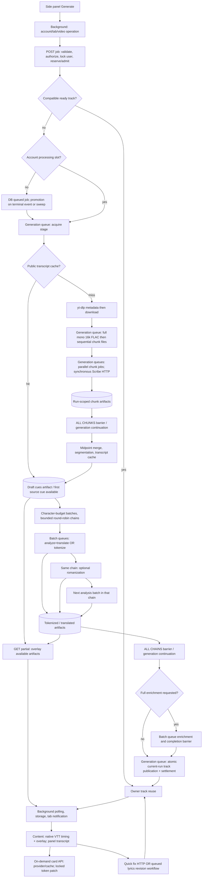

# Whole-project architecture and quality review

Review date: **2026-09-09**, America/Toronto. Checkout: branch **main**, commit **75dbd046f8ef6b71226db85ee271919421dae60b**. The initial tree had one untracked file, `docs/agent-prompts/whole-project-architecture-and-quality-review.md`, which supplied this review's scope. No application changes were present. This report is the only intended new deliverable. The check regenerated a tracked declaration file with a line-ending-only change; that review-created change was restored. No fixes, dependency updates, configuration changes, live generation, paid evaluations, production mutations, or deployments were performed.

## 1. Overall assessment

The project has a credible application structure and substantially better failure and ownership boundaries than its early review documents describe. User-scoped jobs, run IDs, short publication transactions, reservation settlement, guarded artifacts, native subtitle timing, schema-checked API responses, and extension session isolation are worth retaining. The full repository check passes: **440 backend tests / 3,111 assertions**, **222 extension tests / 30 files**, contracts, TypeScript, and the production extension build.

That baseline does not establish paid-beta readiness. Three billing paths have reproducible defects: current Stripe subscription payloads can produce no entitlement, a delayed checkout can regress webhook ordering, and changing the selected plan leaves multiple payable checkout sessions. Subtitle quality also has concrete gaps: token validation accepts omitted source words, Korean spaces are stripped, and midpoint merging can both duplicate and omit boundary words when independent timestamps disagree. These findings are detailed below, including the conditions under which they occur.

The best performance work starts with measurement and the AI critical path. Eleven retained completed jobs provide some useful local evidence, but all are Pro-tier, only one is medium-length, none is near the release limit, and all configured cost estimates are zero. In one short run, source cues were available after **19.409 seconds**, but full completion took **156.539 seconds**; analysis and romanization occupied most of the remainder. That supports investigating those calls before spending heavily on audio conversion optimization. It does not prove which model, batch size, or architecture is best.

This is an independent inspection of implementation paths, followed by historical reconciliation. Findings distinguish **offline reproduction**, **code-confirmed behavior**, **conditional operational risk**, and **unmeasured hypothesis**. Local sequential reproductions do not establish Postgres locking behavior. Passing mocks do not establish transcription or translation quality. No authorship inference was used.

### Reviewed versions and environment

| Layer | Evidence at review time |
| --- | --- |
| Backend locked and installed | Laravel **13.20.0**, Laravel AI **0.6.8**, Fortify **1.37.2**, Sanctum **4.3.2**, Predis **3.5.1**, Boost **2.4.12**, PHPUnit **12.5.31**; checked Composer lock and installed metadata |
| Extension lock / executed tools | WXT **0.20.27**, TypeScript **5.9.3**, Vitest **4.1.10**, jsdom **29.1.1**; production build reports Vite **8.1.4** |
| Local tools | PHP **8.4.21** CLI ZTS, Node **22.20.0**, yt-dlp **2026.08.19**, FFmpeg **N-124279-g0f6ba39122-20260430** |
| Runtime diagnostics | Postgres persistence, Redis queues/cache/concurrency store; configured worker groups total **31**, not a verified count of running OS processes |
| AI configuration | Provider model names are environment-selected. Checked-in OpenAI options request `reasoning.effort=high` and default Fast mode on; the example uses GPT-6 Astra. This does not prove the model or service tier used by every retained historical run. See [AI configuration](C:/transcribed-subtitle-extension/app/backend/config/ai.php:24). |
| Test environment | PHPUnit uses SQLite in memory and many HTTP/queue fakes. The local Postgres/Redis read-only diagnostics succeeded; concurrent production semantics were not exercised. See [PHPUnit configuration](C:/transcribed-subtitle-extension/app/backend/phpunit.xml:20). |

## 2. Architecture and coverage

“Reviewed” means implementations, callers, and relevant tests were inspected; it does not mean every line or every production combination was executed. “Partial” identifies an explicit runtime or surface-coverage limit. No major implemented subsystem was intentionally omitted. Future vocabulary, shadowing, and coaching features remain roadmap scope, not missing implementations of this release; see [product index](C:/transcribed-subtitle-extension/docs/product-specs/index.md) and [active plans](C:/transcribed-subtitle-extension/docs/exec-plans/active).

| Component / coverage | Actual responsibility, ownership, dependencies, and evidence | Limits / judgment |
| --- | --- | --- |
| API and shared contracts — reviewed | Laravel requests validate URLs, IDs, languages, and options; Sanctum ability/owner checks protect account resources. JSON Schema, OpenAPI, generated TypeScript, runtime fetch guards, and representative real response validation join the boundary. [Request](C:/transcribed-subtitle-extension/app/backend/app/Http/Requests/CreateSubtitleJobRequest.php:16), [routes](C:/transcribed-subtitle-extension/app/backend/routes/api.php), [response tests](C:/transcribed-subtitle-extension/app/backend/tests/Feature/ContractResponseValidationTest.php:22), [client](C:/transcribed-subtitle-extension/app/extension/utils/api.ts:216). | Keep validation at external boundaries. Schema conformance cannot prove lexical coverage, correct translation, or timestamps. No need to put a second schema engine in every internal method. |
| Admission, usage, reuse — reviewed | User-row locking serializes submission/reservation decisions. Compatible ready tracks are reused per owner/video/languages/processing version. Queued/running jobs retain identity; reset replaces `run_id`. [Job service](C:/transcribed-subtitle-extension/app/backend/app/Services/Subtitles/SubtitleJobService.php:88), [admission](C:/transcribed-subtitle-extension/app/backend/app/Services/Subtitles/SubtitleJobAdmission.php), [ledger](C:/transcribed-subtitle-extension/app/backend/app/Services/Billing/UsageLedger.php). | SQLite tests cover important state permutations, not parallel Postgres transactions. No evidence found for a generic double-debit allegation. |
| Acquisition and preparation — reviewed | Backend-only yt-dlp metadata/download, public non-live video policy, 60-minute limit, run-local audio workspace, mono 16 kHz FLAC conversion, then sequential overlapping chunk encoding. [Source](C:/transcribed-subtitle-extension/app/backend/app/Services/Audio/YouTubeAudioSource.php:60), [preparer](C:/transcribed-subtitle-extension/app/backend/app/Services/Audio/ElevenLabsScribeAudioPreparer.php:35), [chunker](C:/transcribed-subtitle-extension/app/backend/app/Services/Audio/ScribeAudioChunker.php:26). | No fresh acquisition/audio benchmark or listening test. Source selection and preprocessing quality remain experimental questions. Active code contains no isolation stage. |
| Scribe, merging, normalization, transcript cache — reviewed | Synchronous streamed HTTP upload inside queued chunk jobs; normalized allowlist; midpoint ownership; cue segmentation; public-source transcript cache keyed by video/requested language/model/version. [Adapter](C:/transcribed-subtitle-extension/app/backend/app/Services/Transcription/ElevenLabsScribeTranscriptionService.php:37), [merger](C:/transcribed-subtitle-extension/app/backend/app/Services/Transcription/ScribeChunkPayloadMerger.php:24), [normalizer](C:/transcribed-subtitle-extension/app/backend/app/Services/Transcription/ScribeTranscriptNormalizer.php:41), [cache](C:/transcribed-subtitle-extension/app/backend/app/Services/Transcription/VideoTranscriptCache.php:21). | Concrete boundary defects F05/F06/F08/F09. Cache sharing is for public source transcripts; account edits belong to tracks, not that cache. |
| Language analysis and learning — reviewed | Laravel AI agents return structured arrays; translated cues combine tokenization and translation; same-language/no-translation work takes tokenization path. Optional deterministic/AI romanization, recursive validation retries, optional full enrichment, and on-demand word-card enrichment. [Provider](C:/transcribed-subtitle-extension/app/backend/app/Services/TranslationAnalysis/LaravelAiTranslationAnalysisProvider.php:81), [validator](C:/transcribed-subtitle-extension/app/backend/app/Services/TranslationAnalysis/LearningTokenOutputValidator.php:13), [cards](C:/transcribed-subtitle-extension/app/backend/app/Services/TranslationAnalysis/LearningTokenEnrichmentService.php:27). | No bilingual quality panel or paid evaluation. F04/F07/F10 are more important than reorganizing the large provider class. |
| Orchestration, artifacts, publication — reviewed | Generation queues own acquisition/preparation/Scribe/continuations/finalization. Batch queues own analysis/romanization/enrichment. Database artifacts are scoped to run/type/batch; writes recheck live job under lock. [Pipeline](C:/transcribed-subtitle-extension/app/backend/app/Services/Subtitles/SubtitleGenerationPipeline.php:52), [dispatcher](C:/transcribed-subtitle-extension/app/backend/app/Services/Subtitles/SubtitleBatchDispatcher.php:78), [artifact store](C:/transcribed-subtitle-extension/app/backend/app/Services/Subtitles/SubtitleJobArtifactStore.php:321). | Native Laravel batches/chains are appropriate. Local file paths require all participating workers to see the same workspace. Current single-host runbook can satisfy that; arbitrary horizontal distribution cannot. |
| Partial tracks and correction — reviewed | Draft cues become available only after all Scribe chunks merge. Partial endpoint overlays available analysis artifacts. Quick fix refreshes one cue and changes track/cue identity; full pasted lyrics use encrypted work state, attempt/revision guards, bounded continuation units, and atomic publication. [Partial assembler](C:/transcribed-subtitle-extension/app/backend/app/Services/Subtitles/SubtitlePartialTrackAssembler.php:24), [correction](C:/transcribed-subtitle-extension/app/backend/app/Services/Subtitles/LyricsCorrectionService.php:209), [publication](C:/transcribed-subtitle-extension/app/backend/app/Services/Subtitles/LyricsCorrectionService.php:799). | Full replacement reuses existing timing slots, not forced alignment against audio. Semantic completeness/matching relies partly on provider judgment. Browser timeout behavior for long quick fixes needs proof. |
| Extension background and persistence — reviewed; browser lifecycle partial | Service worker coordinates account/tab/video/job/track/operation ownership. Serialized account and track storage, persisted operations, reconnect polling, stale-result rejection, and cancellation guards. [Background](C:/transcribed-subtitle-extension/app/extension/entrypoints/background.ts:278), [account store](C:/transcribed-subtitle-extension/app/extension/utils/account-session.ts), [track store](C:/transcribed-subtitle-extension/app/extension/utils/active-tracks.ts), [messages](C:/transcribed-subtitle-extension/app/extension/utils/messages.ts). | Executed entrypoint tests are valuable. Actual Chrome suspension/restart, long sessions, multiple windows, and loaded-extension YouTube navigation were not exercised in this review. |
| Content timing, overlay, study controls — reviewed; visual/accessibility partial | Native hidden WebVTT track drives cue events; cue IDs map back to canonical metadata. SPA recovery and identity guards, offset/clamping, seek, hold, hover/focus pause ownership, shadow DOM, escaped text, focus restoration, RTL direction, and teardown. [Content](C:/transcribed-subtitle-extension/app/extension/entrypoints/content.ts:112), [binding](C:/transcribed-subtitle-extension/app/extension/utils/webvtt-track.ts:40), [overlay](C:/transcribed-subtitle-extension/app/extension/utils/overlay.ts:163), [render](C:/transcribed-subtitle-extension/app/extension/utils/overlay/overlay-render.ts:157), [hold](C:/transcribed-subtitle-extension/app/extension/utils/cue-hold.ts). | No screenshot, real screen-reader, zoom/contrast, or playback-rate acceptance run. Overlay correctly avoids replacing identical HTML; do not describe it as unconditional DOM rebuilding. |
| Side panel / transcript — reviewed key workflows; visual partial | Settings, generation/cancel/history, partial source/search/copy, completed transcript seek/edit, account state and timing controls use the existing message boundary. Source transcript and overlay token rendering differ, which exposes F04. [Panel](C:/transcribed-subtitle-extension/app/extension/entrypoints/sidepanel/main.ts), [transcript](C:/transcribed-subtitle-extension/app/extension/utils/panel/transcript.ts). | The current background submits `on_demand` mode. Older Full-word-cards UI claims need reconciliation. No wholesale component-framework migration is warranted. |
| Web/auth/security — reviewed key routes/templates; visual partial | Fortify web auth, Sanctum scoped extension sessions, CSRF web forms, owner-scoped job views/deletion, password-reset token revocation, escaped Blade surfaces and small native JS enhancements. [Token issuer](C:/transcribed-subtitle-extension/app/backend/app/Services/Auth/ExtensionTokenIssuer.php), [reset](C:/transcribed-subtitle-extension/app/backend/app/Actions/Fortify/ResetUserPassword.php:29), [web jobs](C:/transcribed-subtitle-extension/app/backend/app/Http/Controllers/WebSubtitleJobController.php:31), [views](C:/transcribed-subtitle-extension/app/backend/resources/views). | No penetration test, email-delivery proof, or visual accessibility certification. Email verification is a product/document conflict, not silently assumed intended policy. |
| Billing / account deletion — reviewed | Stripe-hosted checkout/portal, signed webhooks, unique event receipt, ordering and subscription identity checks, entitlement, reserved/settled minutes, owner deletion. [Stripe client](C:/transcribed-subtitle-extension/app/backend/app/Services/Billing/StripeClient.php:60), [webhook service](C:/transcribed-subtitle-extension/app/backend/app/Services/Billing/StripeWebhookService.php:117), [account deletion](C:/transcribed-subtitle-extension/app/backend/app/Http/Controllers/AccountController.php:34). | F01–F03 reproduced offline. No real Stripe account/dashboard/configuration was inspected or changed. |
| Persistence, cleanup, telemetry — reviewed | Postgres models/migrations, JSON artifacts/tracks, run-indexed events, stale-worker failure guards, cleanup after terminal transitions, scheduled expiry pruning, runtime/trace/metrics commands. [Failure handler](C:/transcribed-subtitle-extension/app/backend/app/Services/Subtitles/SubtitleJobFailureHandler.php:52), [watcher](C:/transcribed-subtitle-extension/app/backend/app/Console/Commands/FailStalledSubtitleJobs.php:21), [pruner](C:/transcribed-subtitle-extension/app/backend/app/Console/Commands/PruneExpiredSubtitleTracks.php:22). | F11/F12 affect observability. Orphan files after hard termination and retention of failed/canceled jobs need explicit operational policy. |
| Deployment, supervision, backups, harness — reviewed scripts; deployment unverified | Managed Laravel host runbook, Supervisor rendering, audits/readiness, deploy/queue restart, backup and restore helpers, release packaging, aggregate checks. [Runbook](C:/transcribed-subtitle-extension/docs/operations/production-hosting-and-ops.md:7), [ops](C:/transcribed-subtitle-extension/scripts/ops), [check](C:/transcribed-subtitle-extension/scripts/agent/check.ps1). | No deployed topology, real backup restoration, alert, rollback, or active CI execution evidence. These are existing release gaps, not newly discovered missing scripts. |

### Actual execution graph



Synchronous provider calls occupy PHP workers while waiting. A Laravel queue makes the browser request asynchronous; it does not make the queued worker's HTTP call nonblocking. The Scribe request streams a file handle, so it avoids reading the entire upload into PHP memory, but still occupies one generation worker. Analysis likewise blocks a batch worker at `prompt()->toArray()`.

Acquisition, preparation and transcription work outside publication transactions. Artifacts use `(job, run, type, batch)` identity; `put()` re-locks the current running job and refuses stale/completed work. Finalization rechecks the run and ready state before publishing and settling usage. Cache hits skip audio and Scribe but still build requested learning output and settle the new generation; exact ready-track reuse returns earlier. Failures/cancellation release reservations and remove artifacts/workspaces; reset creates a new run and reclaims the old workspace. These are deliberate correctness boundaries, not redundant validation to remove. See [pipeline](C:/transcribed-subtitle-extension/app/backend/app/Services/Subtitles/SubtitleGenerationPipeline.php:419), [artifact writes](C:/transcribed-subtitle-extension/app/backend/app/Services/Subtitles/SubtitleJobArtifactStore.php:321), [cancellation](C:/transcribed-subtitle-extension/app/backend/app/Services/Subtitles/SubtitleJobService.php:245).

The current worker configuration has eight shared generation workers and twenty shared batch workers ordered by Pro/Plus/Base queues, plus one Base-only generation and two Base-only batch workers. Per-user generation caps are 1/2/3; batch caps are 3/12/20. The static per-job chains and per-user middleware serve different purposes. Base reserves protect some capacity; queue ordering alone is not a measured fairness guarantee for Plus under sustained Pro load. See [queue configuration](C:/transcribed-subtitle-extension/app/backend/config/subtitles.php:16) and [concurrency middleware](C:/transcribed-subtitle-extension/app/backend/app/Jobs/Middleware/LimitSubtitleBatchConcurrency.php).

## 3. Findings, ordered by severity

Severity is practical impact, not a security-only scale: **High** requires correction before relying on the affected paid or core-quality contract; **Medium** requires a bounded fix or explicit acceptance with evidence. Each finding is new unless its history says otherwise. Frequency in production is not inferred from synthetic examples.

### F01 — Current Stripe payloads can acknowledge an active subscription without granting access

**Category:** billing compatibility. **Severity:** High. **Confidence:** high; reproduced adapter failure, conditional deployment exposure.

**Trigger and evidence:** an active subscription uses item-level billing periods, as introduced by Stripe's 2025-03-31.basil breaking change. [StripeWebhookService.php:216](C:/transcribed-subtitle-extension/app/backend/app/Services/Billing/StripeWebhookService.php:216) reads only top-level `current_period_start/end`; lines 228–238 retain missing periods and skip the grant. [BillingEntitlementService.php:198](C:/transcribed-subtitle-extension/app/backend/app/Services/Billing/BillingEntitlementService.php:198) requires valid periods. [StripeClient.php:262](C:/transcribed-subtitle-extension/app/backend/app/Services/Billing/StripeClient.php:262) does not pin a request API version. The invoice path at [StripeWebhookService.php:248](C:/transcribed-subtitle-extension/app/backend/app/Services/Billing/StripeWebhookService.php:248) also reads the older `invoice.subscription` field.

An isolated in-memory SQLite / HTTP-faked event produced `{"status":"active","periodEnd":null,"activePlan":null,"grants":0,"webhookProcessed":true}`. Existing fixtures still supply the older top-level period shape, for example [BillingAndUsageTest.php:277](C:/transcribed-subtitle-extension/app/backend/tests/Feature/BillingAndUsageTest.php:277). The webhook can therefore be marked processed while a paying learner has no usable plan. The configured live endpoint version was unavailable; this is not a claim that current customers already suffer it.

**Improvement and validation:** choose and pin a tested request/endpoint version; parse that version's item periods and invoice parent shape; make incomplete active state actionable rather than silently successful. Test sanitized provider-shaped fixtures for checkout retrieval, subscription update, renewal, and invoice events. Preserve receipt idempotency and ledger settlement. Validate endpoint configuration in Stripe test mode before rollout; do not switch webhook versions independently of the parser. Official evidence: [subscription periods](https://docs.stripe.com/changelog/basil/2025-03-31/deprecate-subscription-current-period-start-and-end), [invoice parent](https://docs.stripe.com/changelog/basil/2025-03-31/adds-new-parent-field-to-invoicing-objects), [API versioning](https://docs.stripe.com/api/versioning), checked 2026-09-09. Related evidence gap TD-011 was already tracked; this exact defect is new.

### F02 — Delayed checkout processing can move the webhook ordering watermark backward

**Category:** billing state consistency. **Severity:** High. **Confidence:** high; reproduced.

[StripeWebhookService.php:137](C:/transcribed-subtitle-extension/app/backend/app/Services/Billing/StripeWebhookService.php:137) passes checkout event creation time into subscription-state application. [Line 231](C:/transcribed-subtitle-extension/app/backend/app/Services/Billing/StripeWebhookService.php:231) stores it without keeping the previous maximum. The stale-event filter at [line 362](C:/transcribed-subtitle-extension/app/backend/app/Services/Billing/StripeWebhookService.php:362) then trusts the regressed marker.

**Reproduction:** same subscription; update at T+300 sets canceled; delayed checkout from T+100 retrieves the authoritative canceled subscription but resets the marker to T+100; delayed active update from T+200 is accepted. Observed final state: `active`, active plan `base`; expected latest state: `canceled`. The authoritative checkout retrieval disproves an immediate stale-state claim, but does not repair the ordering marker. Old-subscription identity guards do not help because this is the same subscription. Existing stale/equal-second tests at [test:378](C:/transcribed-subtitle-extension/app/backend/tests/Feature/BillingAndUsageTest.php:378) and [test:483](C:/transcribed-subtitle-extension/app/backend/tests/Feature/BillingAndUsageTest.php:483) cover other permutations.

**Impact / improvement:** canceled entitlement can be restored by old delivery. Preserve monotonic ordering state across every writer, including authoritative refreshes. Add this three-event regression plus equal-time and new-subscription cases. A local maximum/watermark policy is narrower and easier to validate than inventing general precedence among Stripe event types. Roll out with event/state reconciliation for affected subscriptions, without replaying grants blindly.

### F03 — Changing plans leaves multiple payable checkout sessions

**Category:** billing/account lifecycle. **Severity:** High. **Confidence:** high for session creation; double payment not performed.

[StripeClient.php:190](C:/transcribed-subtitle-extension/app/backend/app/Services/Billing/StripeClient.php:190) reuses a pending intent only for the same plan. [Line 213](C:/transcribed-subtitle-extension/app/backend/app/Services/Billing/StripeClient.php:213) replaces it for another plan; [line 60](C:/transcribed-subtitle-extension/app/backend/app/Services/Billing/StripeClient.php:60) creates another subscription-mode session; [line 243](C:/transcribed-subtitle-extension/app/backend/app/Services/Billing/StripeClient.php:243) remembers only the current session. No expiration request closes the old one.

**Reproduction:** Base then Plus generated `cs_base` and `cs_plus` in two faked HTTP calls, recorded only `cs_plus`, and made no expire call. The learner can retain both tabs before an active subscription exists locally. Both sessions remain potentially completable, while [webhook identity checks](C:/transcribed-subtitle-extension/app/backend/app/Services/Billing/StripeWebhookService.php:117) and [account deletion](C:/transcribed-subtitle-extension/app/backend/app/Http/Controllers/AccountController.php:34) track one subscription. Deleting an account with only an open checkout also leaves that checkout outside the active-subscription cancellation path.

**Impact / improvement:** possible duplicate subscriptions or an orphan payment after account deletion. Enforce one outstanding checkout per customer and expire superseded sessions as part of the lifecycle, with reconciliation if the external expiration/create operation fails. Preserve same-plan idempotency. Add cross-plan and deletion-during-checkout tests; then explicitly authorized Stripe test-mode completion tests. [Stripe documents session expiration](https://docs.stripe.com/api/checkout/sessions/expire); checked 2026-09-09. Do not call this an observed double charge.

### F04 — Token validation accepts missing source words and altered surface text

**Category:** subtitle/learning correctness. **Severity:** High. **Confidence:** high; reproduced through the actual validator.

[LearningTokenOutputValidator.php:64](C:/transcribed-subtitle-extension/app/backend/app/Services/TranslationAnalysis/LearningTokenOutputValidator.php:64) searches each normalized token anywhere after the previous match. It never checks skipped lexical characters before/between/after tokens, full-word boundaries for spaced scripts, or exact original casing. This is subsequence acceptance, not source coverage. [Overlay rendering:157](C:/transcribed-subtitle-extension/app/extension/utils/overlay/overlay-render.ts:157) renders source words from `cue.tokens`, so missing tokens become missing displayed words, even when canonical `sourceText` and the panel transcript remain complete.

**Observed offline outputs:** source `Hello world` with one token `world` is accepted; `cat` with token `at` is accepted; `NASA` with token `nasa` is accepted. [LearningTokenOutputValidatorTest.php:26](C:/transcribed-subtitle-extension/app/backend/tests/Unit/LearningTokenOutputValidatorTest.php:26) even permits a Japanese source particle to be omitted. Sequential indices and in-order matching are real safeguards, but do not disprove this defect.

**Improvement:** validate lossless lexical coverage against original source spans, with explicit allowances for whitespace/punctuation rather than arbitrary missing letters. Preserve exact surface slices; store normalized comparison text separately. Token boundaries for CJK/Thai can remain linguistically chosen while coverage remains deterministic. As defense in depth, render canonical text with token spans so invalid enrichment cannot erase source text. This may extend the token contract; a first narrower fix can reject incomplete coverage without a span migration. Add these counterexamples, repeated-word and combining-mark cases, and no-space-script accepted segmentations. Bump affected processing/cache versions after correcting generation. Historical “source-order validation” exists; complete coverage is a new finding.

### F05 — The shared artifact-space rule removes Korean word spacing

**Category:** source fidelity / i18n. **Severity:** Medium. **Confidence:** high; reproduced.

[NoSpaceArtifactBoundary.php:22](C:/transcribed-subtitle-extension/app/backend/app/Services/Text/NoSpaceArtifactBoundary.php:22) includes Hangul in the no-space class; [line 29](C:/transcribed-subtitle-extension/app/backend/app/Services/Text/NoSpaceArtifactBoundary.php:29) deletes every intervening space matching that class. [ScribeTranscriptNormalizer.php:349](C:/transcribed-subtitle-extension/app/backend/app/Services/Transcription/ScribeTranscriptNormalizer.php:349) applies this to actual cue text, not just an internal lookup key. Korean is offered in [the language catalog](C:/transcribed-subtitle-extension/packages/contracts/languages.json:73).

**Reproduction:** `SubtitleText::canonicalComparable('나는 학교에 간다')` returns `나는학교에간다`. The same broad rule is reused by comparison/segmentation, so consistent internal normalization hides the source-text loss. This test establishes removal of supplied spaces; it does not measure its frequency in current Scribe output.

**Improvement:** distinguish actual provider-inserted character separators from intended language word spaces, especially Korean and mixed scripts. Preserve original spacing until a language-aware, provider-grounded cleanup rule proves removal appropriate. Add spaced Korean and mixed Korean/Latin fixtures through normalizer, validator, editing, and display. Retain the fixes for spurious character spaces in Japanese/Chinese and combining marks; do not reverse them globally. Version cached transcripts/derived tracks when the canonical text rule changes.

### F06 — Independent midpoint decisions do not guarantee exactly one boundary word

**Category:** transcription merge correctness. **Severity:** Medium. **Confidence:** high for algorithmic counterexamples; production incidence unmeasured.

[ScribeChunkPayloadMerger.php:83](C:/transcribed-subtitle-extension/app/backend/app/Services/Transcription/ScribeChunkPayloadMerger.php:83) accepts each chunk's word by its own predicted midpoint. It does not align competing overlap text or reconcile timestamp disagreement. The class comment's exactly-one claim assumes neighboring predictions agree.

**Executed example:** nominal split at 100 s; chunk 0 starts at 0, chunk 1 starts at 98. For the same boundary word, chunk 0 predicts 99.4–100.2 (midpoint 99.8), chunk 1 predicts relative 1.8–2.6, hence absolute 99.8–100.6 (midpoint 100.2). Both survive. Swapping the estimates across chunks causes neither to survive. The real merger returned two words and zero words respectively. Existing [merger tests](C:/transcribed-subtitle-extension/app/backend/tests/Unit/ScribeChunkPayloadMergerTest.php) cover deterministic ownership with compatible timings, not this disagreement.

**Impact / improvement:** duplicated/missing words, repeated lyric fragments, and unreliable downstream segmentation. First add perturbation fixtures and measure boundary error rates. Compare bounded overlap text/time alignment against silence-aware split points and the unchanged merger. Reconcile only a small overlap region; repeated phrases must not be globally deduplicated. Preserve absolute timing and stable ordering. A narrow reconciliation algorithm is justified if real boundary errors recur; whole-file transcription is an important quality baseline, not automatically a better latency choice. Increment transcript processing version for a changed merge.

### F07 — Successful fallback can hide absent translation and unusable learning tokens

**Category:** quality contract / error semantics. **Severity:** Medium. **Confidence:** high for behavior; fallback incidence unmeasured.

[LaravelAiTranslationAnalysisProvider.php:442](C:/transcribed-subtitle-extension/app/backend/app/Services/TranslationAnalysis/LaravelAiTranslationAnalysisProvider.php:442) degrades an invalid single-cue analysis to deterministic tokens and source text as translation. [Line 514](C:/transcribed-subtitle-extension/app/backend/app/Services/TranslationAnalysis/LaravelAiTranslationAnalysisProvider.php:514) also substitutes source text for an empty translation. The reprompt catch at [line 462](C:/transcribed-subtitle-extension/app/backend/app/Services/TranslationAnalysis/LaravelAiTranslationAnalysisProvider.php:462) catches any `SubtitleProcessingException`, including a transient failure during that reprompt. [The deterministic tokenizer:211](C:/transcribed-subtitle-extension/app/backend/app/Services/TranslationAnalysis/LaravelAiTranslationAnalysisProvider.php:211) uses grapheme splitting when there is no whitespace: direct invocation with `Hello` returned five letter tokens. Missing romanization is tolerated at [line 984](C:/transcribed-subtitle-extension/app/backend/app/Services/TranslationAnalysis/LaravelAiTranslationAnalysisProvider.php:984).

Preserving a usable source track is reasonable; presenting that result as ordinary complete translation/learning output is the problem. Fallback logs do not become a durable per-cue quality state in [track generation](C:/transcribed-subtitle-extension/app/backend/app/Services/Subtitles/TimestampedSubtitleTrackGenerator.php:83). Documentation still promises loud single-cue/translation/romanization failures, so intent needs a decision rather than treating either layer as authoritative by accident.

**Improvement:** preserve source display, record degraded translation/tokenization/romanization explicitly, and offer bounded retry for missing derived work. Let transient provider exceptions reach the existing retry path. For a single spaced-script word, retain the word; grapheme fallback is an emergency display mechanism, not a word-card segmentation strategy. Test empty translations, invalid single cues, a transient reprompt, no-whitespace Latin, Thai/Lao combining clusters, and absent requested romanization. Do not automatically fail every otherwise useful whole track.

### F08 — Scribe adapter rejects documented nullable timestamps

**Category:** provider boundary compatibility. **Severity:** Medium. **Confidence:** high; reproduced and documented.

[ElevenLabsScribeTranscriptionService.php:171](C:/transcribed-subtitle-extension/app/backend/app/Services/Transcription/ElevenLabsScribeTranscriptionService.php:171) accepts both timing keys absent, but rejects both present with null values. The current [Scribe endpoint schema](https://elevenlabs.io/docs/api-reference/speech-to-text/convert) permits nullable `start` and `end` (checked via the official endpoint's `/llms.txt` representation on 2026-09-09).

**Executed boundary cases:** omitted times accepted as untimed text; `start:null,end:null` rejected with `invalid_word_timing`. An empty `words:[]` is also rejected as `missing_words` at [line 153](C:/transcribed-subtitle-extension/app/backend/app/Services/Transcription/ElevenLabsScribeTranscriptionService.php:153). Empty-chunk frequency on silence/instrumental sections is a hypothesis, not an observed provider result. The merger itself accepts an empty chunk array of words, making the adapter the earlier barrier.

**Improvement:** normalize the documented null pair into the existing untimed representation; retain rejection of one-sided, negative, nonfinite, or reversed numeric times. Define no-speech chunk versus no-speech whole-video behavior using captured provider fixtures. A silent chunk should not automatically invalidate good speech elsewhere, but the final track must still contain usable timed content. Add boundary tests before live validation; no API contract expansion is necessary for null normalization.

### F09 — One transient Scribe error terminates the complete generation

**Category:** reliability / avoidable rework. **Severity:** Medium. **Confidence:** high from the request and job path; outage reproduction not run.

[TranscribeSubtitleAudioChunk.php:34](C:/transcribed-subtitle-extension/app/backend/app/Jobs/TranscribeSubtitleAudioChunk.php:34) sets `maxExceptions=1`; its middleware contains only batch cancellation. [Adapter request:250](C:/transcribed-subtitle-extension/app/backend/app/Services/Transcription/ElevenLabsScribeTranscriptionService.php:250) has a timeout but no request retry/backoff. Failure reaches [SubtitleJobFailureHandler.php:81](C:/transcribed-subtitle-extension/app/backend/app/Services/Subtitles/SubtitleJobFailureHandler.php:81), which releases the reservation and removes artifacts/workspace. Successful sibling chunks are not preserved for a user retry.

**Trigger / impact:** a 429, transient server failure, or connection interruption in one chunk can discard the whole attempt and force acquisition/transcription again. A network timeout after provider acceptance has ambiguous billable outcome; retries are not free exactly-once operations. Queued analysis already has bounded transient retries, so the historical assertion that every AI stage lacks retries is false.

**Improvement:** add bounded, jittered, provider-aware retries to the chunk job, respecting `Retry-After`, cancellation/run identity, provider concurrency and the overall deadline. Preserve successful chunk artifacts until the retry budget is exhausted. Do not retry validation/auth errors. Validate 429→success, 503→success, exhaustion, cancellation during delay, worker death and late success. Record attempted cost separately from successful generation cost. Start with this narrow fix before adopting a new asynchronous transcription service.

### F10 — The AI rate guard counts jobs, while one job can issue many requests

**Category:** capacity / deadline reliability. **Severity:** Medium. **Confidence:** high for scope mismatch; load effect unmeasured.

[SubtitleCueBatchJob.php:55](C:/transcribed-subtitle-extension/app/backend/app/Jobs/SubtitleCueBatchJob.php:55) consumes the global limiter once per queue execution. Recursive invalid-batch splitting in [provider:383](C:/transcribed-subtitle-extension/app/backend/app/Services/TranslationAnalysis/LaravelAiTranslationAnalysisProvider.php:383) performs sequential provider calls inside that execution. On-demand cards, quick fixes, and lyrics processing use other call paths. [Configuration:199](C:/transcribed-subtitle-extension/app/backend/config/subtitles.php:199) therefore is not a complete provider-wide request/token limiter.

The batch maximum is 20 cues. In the pathological case where every internal batch validation fails, a binary split tree can make **2N−1 = 39** calls before completion/fallback, excluding additional single-cue reprompts. This is a calculated bound, not a measured workload. The batch job timeout is 300 s and each configured AI call can consume 120 s; even a few slow split calls can exceed the queue-unit deadline. The existing per-user lease and retry backoff are useful, but do not bound request count or total inline retry time.

**Improvement:** enforce provider request budgets at the shared call boundary, include interactive/correction paths, and expose token as well as request pressure where supported. Give each queue unit a remaining wall-clock/call budget; defer smaller work instead of recursively consuming an unbounded fraction of a worker deadline. Preserve per-user fairness. Test malformed-output amplification and mixed interactive/background load, including mid-retry cancellation. Do not simply raise worker counts or set the global limit to the provider's advertised maximum.

### F11 — Metrics can combine an old run's time with the current run's cost

**Category:** observability / decision quality. **Severity:** Medium. **Confidence:** high; reproduced. **History:** exact defect new; representative measurement gap already TD-010.

[ShowSubtitleGenerationMetrics.php:24](C:/transcribed-subtitle-extension/app/backend/app/Console/Commands/ShowSubtitleGenerationMetrics.php:24) loads events across runs; [line 87](C:/transcribed-subtitle-extension/app/backend/app/Console/Commands/ShowSubtitleGenerationMetrics.php:87) selects the first completion; lines 97–110 aggregate waits but read current job cost. [Reset:374](C:/transcribed-subtitle-extension/app/backend/app/Services/Subtitles/SubtitleJobService.php:374) changes run, cost, and submission timestamp while preserving historical events.

**Reproduction:** old completion 111000 ms / wait 9999 ms; current completion 222000 ms / wait 20 ms / cost 222. The metrics row reports 111000 / 9999 with current cost 222. The eleven actual samples in section 5 were independently checked and are **not contaminated by this defect**: rows with multiple run IDs had only one completed run.

**Improvement:** aggregate immutable `(job_id,run_id)` records or filter strictly to the current run. Separate successful-run latency from all-attempt failure/retry/cost data. Current metrics exclude failed/canceled jobs and use mutable `created_at`; maximum per-job queue wait is not total queue delay or admission delay. Successful ledger cost also excludes a complete view of failed attempts and later enrichment. Add multi-run tests and publish metric definitions before using them for tier promises or margins.

### F12 — Runtime summary undercounts large active sets and queue work

**Category:** operations / diagnostics. **Severity:** Medium. **Confidence:** high from implementation; local overload not observed.

[ShowSubtitleRuntime.php:29](C:/transcribed-subtitle-extension/app/backend/app/Console/Commands/ShowSubtitleRuntime.php:29) limits the active-job list to 25; [line 58](C:/transcribed-subtitle-extension/app/backend/app/Console/Commands/ShowSubtitleRuntime.php:58) calls its size `activeJobCount`. [Line 151](C:/transcribed-subtitle-extension/app/backend/app/Console/Commands/ShowSubtitleRuntime.php:151) uses Redis `LLEN`, excluding delayed and reserved work.

**Trigger / impact:** more than 25 running jobs or retries/in-flight queue jobs can make this look like a smaller workload. Current local counts were zero, so no current undercount is alleged. **Improvement:** independent total count, explicit list truncation, and separately named ready/delayed/reserved counts. Verify 26 running jobs plus one item in each Redis structure. Configured worker count must remain distinct from verified supervised processes. This is a small diagnostic correction, not a reason to add a monitoring platform by itself.

### F13 — Laravel AI's actual 503 exception bypasses the application's transient retry policy

**Category:** reliability / installed SDK compatibility. **Severity:** Medium. **Confidence:** high; reproduced with the real installed SDK and a faked HTTP response.

Laravel AI 0.6.8 converts HTTP 503 into `Laravel\Ai\Exceptions\ProviderOverloadedException` in [HandlesFailoverErrors.php:34](C:/transcribed-subtitle-extension/app/backend/vendor/laravel/ai/src/Gateway/Concerns/HandlesFailoverErrors.php:34). [OpenAiGateway.php:71](C:/transcribed-subtitle-extension/app/backend/vendor/laravel/ai/src/Gateway/OpenAi/OpenAiGateway.php:71) uses that wrapper. The application's [promptAgent():663](C:/transcribed-subtitle-extension/app/backend/app/Services/TranslationAnalysis/LaravelAiTranslationAnalysisProvider.php:663) handles the SDK rate-limit exception and raw Laravel connection/request exceptions, but not the SDK overload exception. Its final branch creates non-transient `enrichment_failed`.

**Reproduction:** boot the app with null logging/array cache and dummy provider credentials; prevent stray requests; fake all HTTP responses as 503; invoke the real tokenization provider. Result: `SubtitleProcessingException`, `publicCode=enrichment_failed`, `isTransient=false`, previous message `AI provider [openai] is overloaded.` No provider was contacted. [SubtitleCueBatchJob.php:74](C:/transcribed-subtitle-extension/app/backend/app/Jobs/SubtitleCueBatchJob.php:74) consequently takes the immediate-fail branch instead of its documented transient retry branch. [Lyrics alignment:978](C:/transcribed-subtitle-extension/app/backend/app/Services/Subtitles/LyricsCorrectionService.php:978) has the same exception-mapping omission.

**Improvement:** map the installed SDK's overload exception explicitly to provider-unavailable/transient status at both boundaries, ideally through one narrow shared classifier. Preserve non-retryable handling for validation, credentials, and exhausted credits. Test HTTP 429/500/503/connection failure through the real SDK adapter rather than only throwing application exceptions from mocks. This is a recurrence in effect of the older transient-retry concern, with a newly demonstrated SDK-specific cause; the queue retry mechanism itself is already implemented.

## 4. Ranked improvement opportunities

Findings above are fixes. The following ranks the wider improvement work; **H** means a hypothesis needing measurement, **C** means code-supported mechanism, and **M** means measured local evidence. Effort estimates are engineering judgment for implementation plus focused verification: small roughly 1–2 days, medium several days to two weeks, large multiple weeks with deployment work. They are not delivery commitments. References to F/E identifiers carry their evidence and acceptance conditions.

| Rank / opportunity | Mechanism, evidence, effort and tradeoff | Contracts / dependencies / decisive validation |
| --- | --- | --- |
| 1. Correct billing and source fidelity | F01–F05 and F13 have deterministic counterexamples. Small/medium per fix. These prevent paid access errors and missing/altered displayed words; cosmetic modularization would not. | Preserve owner/run/ledger identity, exact source text, and explicit processing-version invalidation. Billing provider version and intended fallback policy are dependencies. Require all counterexamples to fail safely or produce correct output. |
| 2. Make latency and cost attributable to a run and request | F11/F12; [promptAgent:663](C:/transcribed-subtitle-extension/app/backend/app/Services/TranslationAnalysis/LaravelAiTranslationAnalysisProvider.php:663) discards the response object after `toArray()`. Installed [Usage](C:/transcribed-subtitle-extension/app/backend/vendor/laravel/ai/src/Responses/Data/Usage.php:10) exposes prompt/completion/cache/reasoning tokens. C/M, medium. Capture attempt duration, model, prompt version, tokens, outcome, request correlation, and actual service tier where available. | No transcript/raw provider bodies in normal logs. Keep estimates distinct from invoice reconciliation. The installed SDK's `Meta` has provider/model, not every HTTP header or service-tier field; a narrow HTTP hook may be needed for those. Validate E01 before changing throughput settings. |
| 3. Tune AI work per stage | The short trace in section 5 is dominated by analysis/romanization; [AI config:24](C:/transcribed-subtitle-extension/app/backend/config/ai.php:24) applies high reasoning broadly. M/H, medium. Compare lower supported effort, the current model, and a smaller structured-output-capable model separately for tokenization, translation, and romanization. | Preserve exact token identity, bilingual quality, cue ordering and supported scripts. Do not choose by coding benchmarks. E02 gives acceptance thresholds; keep the existing model/config as rollback. |
| 4. Bound retries and provider-wide demand | F09/F10/F13. C, medium. Use typed transient classification, jittered backoff, request-level limits and a queue-unit deadline. The default nine generation workers can issue more simultaneous Scribe requests than one eight-request provider allowance; actual account limits are unknown. | Preserve account caps, avoid retry storms, account for potentially billed timeouts, and recheck run identity before each request. E06 simulates failures and measures fairness. |
| 5. Reconcile chunk boundaries and test chunk sizes | F06; [chunker:26](C:/transcribed-subtitle-extension/app/backend/app/Services/Audio/ScribeAudioChunker.php:26). C/H, medium. Compare current fixed splits with local silence-aware cuts and bounded overlap alignment; tune threshold/length/overlap only after quality measurement. | Preserve media-time offsets, repeated lyrics, no missing speech, and cache versioning. E04 isolates quality from upload/parallelism. More overlap increases billed duration and does not itself solve disagreement. |
| 6. Reduce chain head-of-line blocking | [Dispatcher:78](C:/transcribed-subtitle-extension/app/backend/app/Services/Subtitles/SubtitleBatchDispatcher.php:78) round-robins batches into fixed chains containing analysis→romanization→next analysis. A slow romanization can hold later translation in the same lane; a slow lane cannot be rebalanced. C/H, medium. First compare analysis-first scheduling or smaller balanced batches; only then use dynamic per-batch continuations. | Keep per-user concurrency and same-batch token identity. Do not claim romanization still waits for the entire analysis stage: it already overlaps across batches. Measure first translated cue and full completion separately in E02/E06. |
| 7. Simplify audio preparation when evidence supports it | [Preparer:35](C:/transcribed-subtitle-extension/app/backend/app/Services/Audio/ElevenLabsScribeAudioPreparer.php:35), [source:143](C:/transcribed-subtitle-extension/app/backend/app/Services/Audio/YouTubeAudioSource.php:143). C/H, small/medium. Compare direct supported-source upload, current FLAC, and raw PCM; avoid encoding the whole file then re-encoding all chunks when a single extraction strategy suffices. | Audio conversion must preserve duration/timing and not introduce recognition regressions. Current conversion was only 0.237 s in the slow short trace, so its maximum direct benefit there is small. E03 includes CPU/network and reference accuracy. |
| 8. Improve preprocessing selectively | Mono downmix may suppress a phase-opposed vocal or mix separate speakers; denoising/isolation may remove consonants or alter singing. H, medium. Test channel selection, gain/loudness adjustment, and isolation only on labelled quiet/noisy/stereo/music inputs. | No universal “cleaner audio is better recognition” assumption. Keep silence and timing; retain raw baseline for evaluation only under explicit retention. E03 rejects quality regressions even if audio sounds cleaner. |
| 9. Deliver and persist partial updates more cheaply | [Partial assembler:24](C:/transcribed-subtitle-extension/app/backend/app/Services/Subtitles/SubtitlePartialTrackAssembler.php:24) rebuilds a full response from artifacts; [background:695](C:/transcribed-subtitle-extension/app/extension/entrypoints/background.ts:695) polls and persists updates; [content:477](C:/transcribed-subtitle-extension/app/extension/entrypoints/content.ts:477) rebinds a new partial revision. C/H, small/medium. Skip unchanged revision storage/notifications and measure payload size before considering deltas/SSE. | Include run identity in any revision protocol; preserve final atomic publication, reconnect recovery, search/copy and timing. E07 measures bytes, writes, layout and lost updates. Changing transport alone will not reduce provider time. |
| 10. Audit cache identity and reuse with explicit quality versions | [Transcript cache:21](C:/transcribed-subtitle-extension/app/backend/app/Services/Transcription/VideoTranscriptCache.php:21), [processing versions](C:/transcribed-subtitle-extension/app/backend/app/Support/SubtitleProcessingVersion.php), [card key:165](C:/transcribed-subtitle-extension/app/backend/app/Services/TranslationAnalysis/LearningTokenEnrichmentService.php:165). C/H, small/medium. Generated-track versions are manual rather than automatically keyed by every environment model change. Concurrent transcript misses can duplicate paid work. Card keys include cue text and normalized word but omit token occurrence, potentially sharing different meanings of the same word within one cue. | Do not share private edited tracks globally. A cache single-flight lease is useful only if duplicate misses are measured. Test repeated ambiguous words in one cue before adding token-index/span identity. Preserve exact ready-track reuse billing behavior and explicit invalidation. |
| 11. Make card completeness and corrections explicit | [Metadata check:150](C:/transcribed-subtitle-extension/app/backend/app/Services/TranslationAnalysis/LearningTokenEnrichmentService.php:150) treats any one metadata field as enough to skip enrichment. [Quick fix:252](C:/transcribed-subtitle-extension/app/backend/app/Services/Subtitles/LyricsCorrectionService.php:252) compares normalized text, so a case-only correction can be rejected as unchanged. C, small after product acceptance criteria are fixed. | Decide minimum useful card fields and whether spelling/case-only corrections are supported; test ambiguous repeated words and incomplete cached cards. Quick fix currently waits on synchronous provider work while [client timeout:196](C:/transcribed-subtitle-extension/app/extension/utils/api.ts:196) is 60 s: test late commit/recovery before deciding to reuse a durable correction operation. |
| 12. Reduce avoidable reads and keep orchestration legible | [Dashboard:78](C:/transcribed-subtitle-extension/app/backend/app/Http/Controllers/DashboardController.php:78) loads tracks although the recent-job mapping does not use them. [Cue processor:33](C:/transcribed-subtitle-extension/app/backend/app/Services/Subtitles/SubtitleCueBatchProcessor.php:33) reads full cue collections for context; artifact access logs/writes add overhead. C/H, small. Measure SQL/JSON payload and remove proven waste. | Keep the pipeline as the visible execution map. Extract the shared provider error boundary and repeated state transitions when needed; do not introduce a generic workflow engine, repository layer, or DTO for every array. Validate long-track memory/SQL bytes, not just line count. |
| 13. Close deployment, retention and browser evidence gaps | Existing TD-003/007/009/010/011/012/015. C, medium/large depending on staging access. Add Linux Postgres/Redis fault tests and a deterministic built-extension smoke harness to the actual release gate. | Preserve the simple managed-host architecture until scale measurements justify distributed workers. Prove backup restore, worker restart and actual yt-dlp/FFmpeg/mail capabilities. E06/E07/E08 define evidence. |

### Other reviewed boundaries and limitations

Input/process boundaries are substantially sound: URL validation restricts HTTPS YouTube hosts and matching video identity; process arguments are arrays; acquired paths are checked against the workspace; provider credentials stay server-side. [Create request:87](C:/transcribed-subtitle-extension/app/backend/app/Http/Requests/CreateSubtitleJobRequest.php:87), [audio source:168](C:/transcribed-subtitle-extension/app/backend/app/Services/Audio/YouTubeAudioSource.php:168), and [safe logging allowlist](C:/transcribed-subtitle-extension/app/backend/app/Services/Subtitles/SubtitleWorkflowLogger.php:17) support this judgment. The old raw-process-context logging issue is not re-reported. Model prompts contain untrusted source text but the inspected subtitle agents do not expose tools that could execute source instructions; semantic corruption still requires adversarial fixtures.

Correction publication is a strong boundary. Full replacement checks account entitlement, live job/run/track/attempt/revision, validates pasted-part coverage and monotonically assigned timing slots, and clears transient work state after publication. Quick fix does provider work outside the transaction and rechecks identity before commit. Partial lyrics acceptance is explicit; the process cannot prove acoustic alignment or repair missing timing slots merely by redistributing text. See [correction units:333](C:/transcribed-subtitle-extension/app/backend/app/Services/Subtitles/LyricsCorrectionService.php:333), [derived batches:675](C:/transcribed-subtitle-extension/app/backend/app/Services/Subtitles/LyricsCorrectionService.php:675), [publication:799](C:/transcribed-subtitle-extension/app/backend/app/Services/Subtitles/LyricsCorrectionService.php:799), [alignment validation:1071](C:/transcribed-subtitle-extension/app/backend/app/Services/Subtitles/LyricsCorrectionService.php:1071). A future acoustic alignment feature would change that contract and needs a separate benchmark.

Track/artifact JSON is inspectable, but long videos amplify serialization and whole-track writes. Existing locking preserves concurrent token patches; moving every token to its own database row is not justified without measured write contention. The artifact store validates external-ish persisted shapes and uses run identity; it does not deeply revalidate every cue on every read, which is reasonable when producer boundaries enforce invariants. F04 shows why those producer invariants matter more than proliferating array wrappers.

Normal cleanup covers completion, failure, cancellation and reset. Hard-killed preparation may leave workspace files that a later terminal cleanup removes, but this is not a measured orphan-free guarantee. Failed/canceled jobs have no expiry assigned by [failure handling:81](C:/transcribed-subtitle-extension/app/backend/app/Services/Subtitles/SubtitleJobFailureHandler.php:81) or [cancellation:273](C:/transcribed-subtitle-extension/app/backend/app/Services/Subtitles/SubtitleJobService.php:273); [pruning:30](C:/transcribed-subtitle-extension/app/backend/app/Console/Commands/PruneExpiredSubtitleTracks.php:30) requires an expired timestamp. Set explicit retention for these jobs/events, failed queue jobs, batches and expired Sanctum tokens, while retaining the financial ledger as required by the product's retention policy. No unbounded-growth rate was measured.

The scheduler assumes the current simple deployment. [Scheduled sweeps](C:/transcribed-subtitle-extension/app/backend/routes/console.php:5) do not use overlap/single-server locks; do not add distributed coordination unless multiple schedulers or long sweeps are introduced. `/up` is liveness, not proof of active workers, scheduler, audio tools, database recovery or provider health. [Deploy script:61](C:/transcribed-subtitle-extension/scripts/ops/deploy-managed-laravel.ps1:61) skips the HTTP check when `HealthUrl` is absent even without `SkipHealthCheck`; make that release contract explicit. Readiness checks cannot substitute for executing the deployed binaries and restoring a real backup.

## 5. Pipeline optimization analysis and decisive experiments

### Available measurements

Diagnostic implementations were read before use. The seven-day `subtitles:metrics --json` result contains **11 completed jobs, 49.38 source minutes**, all Pro. The inspected row window also contains one canceled job. Rows may be reset or deleted, so this is not a representative completion/failure rate. Two rows contain multiple run IDs; direct reconciliation found only one completion each and no old-run contamination in these eleven reported observations.

| Group | n | Source length | Completion p50 | Completion p95 | p95 of maximum per-job queue wait |
| --- | ---: | --- | ---: | ---: | ---: |
| Pro short | 10 | 160–245 s | 61.401 s | 156.539 s | 70.502 s |
| Pro medium | 1 | 965 s | 71.952 s | 71.952 s | 22.832 s |

The medium row is one observation, not evidence of a population p95. Two short jobs exceeded the configured 120-second budget. Provider-cost estimates total zero; neither free processing nor a viable margin follows. Sampling conditions, provider load, model revisions, feature combinations and cache conditions were not controlled across rows. Metrics definitions come from [ShowSubtitleGenerationMetrics.php:87](C:/transcribed-subtitle-extension/app/backend/app/Console/Commands/ShowSubtitleGenerationMetrics.php:87); timing events from [SubtitlePipelineTelemetry.php:77](C:/transcribed-subtitle-extension/app/backend/app/Services/Subtitles/SubtitlePipelineTelemetry.php:77).

Two current-run traces illustrate different critical paths:

| Milestone | Short run | Medium run |
| --- | --- | --- |
| Job / run | `cd8590a4-817c-4e91-bfa9-90995b6cee1a` / `f337d814-1950-4ef3-b01b-03eb6ff22795` | `f6f42c90-20d8-4297-861f-bb5342b4e0d2` / `3d7b10d4-2f47-477f-805d-111bf04c54f0` |
| UTC completion | 2026-09-09 03:02:35 | 2026-09-09 00:07:17 |
| Acquisition active time | 7.642 s | 7.668 s |
| Optimization active time | 0.237 s | 2.378 s |
| Transcribing-stage elapsed | 11.141 s | 14.428 s, eight chunk jobs |
| First source cue available in backend | **19.409 s** from job timestamp | **24.871 s** from job timestamp |
| Analysis | Two batches: 64.100 s and 67.559 s; completion timestamps 03:01:22 / 03:01:28 | Sixteen batches; individual times 10.501–37.782 s; stage wall-clock interval approximately 00:06:30–00:07:17 |
| Romanization | Two batches: 53.129 s / 66.411 s; last ends 03:02:35 | No romanization stage event in this run |
| Assembly / finalization | 0.043 s / 0.059 s | 0.034 s / 0.076 s |
| Full completion | **156.539 s** | **71.952 s** |

These are existing local records, not jobs started by the reviewer. Concurrent batch durations must not be summed as latency. Acquisition-stage timing does not separately resolve metadata extraction, download, or network wait. The transcribing-stage value includes fan-out/merge scheduling, not isolated provider compute. First-cue availability means the backend has draft cues; browser-visible first cue additionally needs a successful poll, notification, track binding and playback at that cue. No browser timestamp was recorded. First translated/romanized artifact completion can be inferred from trace events, but time to the viewer's first useful translated cue was not measured.

The miss critical path is approximately:

`admission wait + generation queue waits + acquisition + preparation/splitting + slowest scheduled Scribe chunk + merge + slowest scheduled analysis/romanization chain + optional full-enrichment barrier + publication`.

The cache-hit path removes acquisition/preparation/Scribe, not subsequent AI work. The ready-track path bypasses generation entirely. At load, shared worker occupancy and account/provider limits alter every queue term; speeding one request is not the same as improving throughput or fairness. Fixed chains couple later analysis to earlier romanization. Source partials help perceived waiting only after the all-chunk barrier. References: [pipeline cache path:358](C:/transcribed-subtitle-extension/app/backend/app/Services/Subtitles/SubtitleGenerationPipeline.php:358), [analysis dispatch:486](C:/transcribed-subtitle-extension/app/backend/app/Services/Subtitles/SubtitleGenerationPipeline.php:486), [batch window:78](C:/transcribed-subtitle-extension/app/backend/app/Services/Subtitles/SubtitleBatchDispatcher.php:78).

### Audio and linguistic assessment

The source selector prefers an available M4A before WebM, then generic best audio. This optimizes a format preference, not verified maximum source quality. Metadata extraction precedes a second yt-dlp invocation for download; the current code does not reuse an extracted info file. [YouTubeAudioSource.php:60](C:/transcribed-subtitle-extension/app/backend/app/Services/Audio/YouTubeAudioSource.php:60), [line 143](C:/transcribed-subtitle-extension/app/backend/app/Services/Audio/YouTubeAudioSource.php:143). Avoiding the second extraction is a testable narrow efficiency change, but signed URL expiry and extractor behavior must be handled.

All acquired sources are decoded into mono 16 kHz FLAC. FLAC preserves that converted signal without adding another lossy encode; it cannot restore information lost in the source codec or resampling. Mono saves bytes and often fits speech, but cannot preserve separate channels or guarantee a good mix for stereo music/overlapping speakers. No gain normalization, denoising, voice isolation or silence removal is active. These are choices to evaluate, not evidence of an intrinsically bad pipeline. Reference: [preparer:35](C:/transcribed-subtitle-extension/app/backend/app/Services/Audio/ElevenLabsScribeAudioPreparer.php:35).

At defaults, audio at least 240 s is split with a 120 s target, two seconds of context on each side, and a cap of eight chunks. For duration D and N chunks, uploaded duration is approximately `D + 4(N−1)` seconds, ignoring rounding/edge caps. At 240 s / two chunks this is 244 s, **1.67%** extra; at 3600 s / eight chunks it is 3628 s, **0.78%** extra, and nominal chunks are **450 s**, not 120 s. These are calculations from [ScribeAudioChunker.php:26](C:/transcribed-subtitle-extension/app/backend/app/Services/Audio/ScribeAudioChunker.php:26), not observed provider billing. Preparation does one full conversion followed by sequential per-chunk encodes; parallel HTTP begins only after that. Retrying whole attempts can cost much more than overlap alone.

Explicit language is sent unless `auto`; chunk auto-detection can disagree, but the first chunk's language becomes canonical. An instrumental/foreign-language introduction can therefore influence the entire learning pipeline. No retained sample proves that happened. Word-level output is requested, audio-event tagging and diarization are disabled, and the adapter discards confidence/log-probability/character/speaker metadata. Retain a small confidence/detection summary only if it powers a tested fallback or QA metric; do not start storing raw responses indiscriminately. [Request payload:278](C:/transcribed-subtitle-extension/app/backend/app/Services/Transcription/ElevenLabsScribeTranscriptionService.php:278), [allowlist:145](C:/transcribed-subtitle-extension/app/backend/app/Services/Transcription/ElevenLabsScribeTranscriptionService.php:145), [language selection:37](C:/transcribed-subtitle-extension/app/backend/app/Services/Transcription/ScribeChunkPayloadMerger.php:37).

Segmentation uses duration, character count, logical-word count, gaps and clause cues; current no-space handling avoids treating every CJK character as a logical word. Constants are 6 s / 84 characters / 14 logical words with pause heuristics. There is no explicit characters-per-second acceptance criterion, and overlap clamping can shorten a cue. Numeric timing is validated, but an upper bound against known media duration is not enforced through the normalized final segment path. Out-of-media timestamps and rapid reading are hypotheses to test, not claimed observed output defects. [Normalizer constants](C:/transcribed-subtitle-extension/app/backend/app/Services/Transcription/ScribeTranscriptNormalizer.php:13), [segmentation](C:/transcribed-subtitle-extension/app/backend/app/Services/Transcription/ScribeTranscriptNormalizer.php:155), [timing clamp](C:/transcribed-subtitle-extension/app/backend/app/Services/Transcription/ScribeTranscriptNormalizer.php:329).

Grapheme-safe fallback protects marks but does not establish learner-friendly words. CJK, Thai/Lao/Khmer and mixed scripts require reference boundaries and bilingual review; RTL needs both correct text and real layout checks. Deterministic romanization is already limited to configured languages and explicitly excludes cases whose pronunciation needs context. Keep that gate. Fixed transliteration should not be expanded to Japanese readings or Korean sound changes simply to remove an AI request. See [romanization configuration](C:/transcribed-subtitle-extension/app/backend/config/subtitles.php:116).

### Experiments to settle the decisions

All experiments below are proposed, not performed. Provider-backed runs need separate authorization and a capped budget. A “public video” test should record video ID, selected excerpt/duration, source format, script, speech/music/noise labels, model snapshot/alias, prompts, options, tier, cache state, worker topology and provider quotas. Hold those constant for paired comparisons. Use reference transcripts and human language review; another model's preference is not ground truth.

| ID | Baseline and isolated change | Resource estimate and measurements | Acceptance / rejection criteria |
| --- | --- | --- | --- |
| E01 — reproducible baseline | Current code after correctness/telemetry fixes. Separately measure ready-track reuse, transcript-cache hit, and complete miss. Start with 6 short, 3 medium and 3 near-limit representative public videos, three repeated runs each. Add feature/tier/load variations in a second pass rather than a huge uncontrolled Cartesian matrix. | **36 generations**. Assuming 3 / 15 / 55 min examples: `3×(6×3+3×15+3×55)=684` source minutes plus overlap. This is an explicit planning estimate. Record admission/ready/delayed/reserved wait, request/CPU/disk/network/memory, first source/translated/romanized cue, full completion, failures/retries and all attempted provider usage. | Require run-pure records and nonzero priced usage. Three repeats are exploratory; use at least 20–30 matched runs in important cells before treating tail percentiles as useful, with uncertainty and sample counts. Do not publish tier SLAs from n=1 or success-only data. |
| E02 — model, effort and batch scheduling | Fix source input and gold cues; vary one of model, supported reasoning effort, batch character budget, max cues, romanization fusion/scheduling, or Fast mode at a time. Compare current 1000-character/20-cue batching against smaller/larger budgets. Only combine winners afterwards. | First screen the **36 existing fixtures** (12 each Japanese/Mandarin/Thai), then representative translation/romanization samples including Korean, RTL, combining marks and mixed language. `subtitles:eval-tokenization --lang=all --model=<candidate> --json` is live, with no offline mode; three models × three repeats is at least **324 calls**, potentially more with reprompts. | Hard gate: no source loss or identity drift. Proposed optimization target: ≥15% paired p50 improvement with no >5% p95 regression and no material human-rated quality loss; thresholds are decision criteria, not measured results. Report token-boundary precision/recall, semantic omissions, fallback rate and actual cost. Reject a faster model that weakens quality or increases retries. |
| E03 — source and preparation | On the same downloaded sources compare current FLAC, direct supported source, raw mono PCM, and selected-channel/native-rate candidates. For selected noisy/music cases separately test gain, denoise or isolation. Also compare provider URL ingestion as its own path, keeping preflight duration/public-video checks. | Example screen: eight 60–90 s clips, four variants, three repeats: **96 STT requests / 96–144 source minutes** before overlap. Isolation adds its own billed processing. Measure conversion CPU, peak RSS, file/upload bytes, end-to-end latency, WER for spaced speech, CER where appropriate, named entities/lyrics, and timing error. | Reject variants with increased boundary/timing errors or lost speech even if file size/latency improves. Compare stereo/overlapping speech and phase-opposed synthetic audio. Do not remove silence without an explicit map back to original media time. Direct URL support may simplify operations, but must meet acquisition availability, quality, duration enforcement and retry observability requirements. |
| E04 — chunk boundaries | Current whole-file and fixed-overlap baselines versus silence-aware cuts, different overlaps/lengths and bounded overlap alignment. Include synthetic midpoint perturbations and real repeated lyrics near each split. | Use stored authorized audio/reference fixtures offline first. Then six 8–15 min sources × four strategies × two repeats: **384–720 source minutes** plus overlap. Measure chunk service time, scheduling spread, duplicated/missing/reordered words within ±5 s of cuts, and cue timing. | Zero synthetic coverage failures; no increase in real boundary WER/CER versus whole-file baseline. Adoption requires meaningful tail-latency or throughput benefit as well as quality. Reject global text deduplication that removes repeated choruses. |
| E05 — honest learning fallback | Current fallback against explicit degraded flags, word-preserving fallback and bounded per-cue repair. Use empty/partial/contradictory structured outputs and source instructions trying to redirect the task. | Mostly offline HTTP/agent fakes; bilingual review of selected outputs. Measure lossless source coverage, missing translation/romanization visibility, card usefulness and repair requests. | Source remains readable, no source text masquerades as completed translation, requested missing features are visible, retries remain bounded, and case/combining marks survive. Native script rendering remains available even when enrichment fails. |
| E06 — capacity and failure recovery | Current queue topology; simulate 429/500/503/timeouts, Redis publication ambiguity, worker kill, cancellation/reset, and multiple users across Base/Plus/Pro. Compare narrowed retry/deadline/limiter fixes before any extra workers. | Disposable Linux Postgres/Redis with delayed/fake providers: **zero paid calls** for most tests. Record real worker slots, leases, queue states, request counts, duplicate external attempts, reservation release/debit and workspace cleanup. Then a small capped real-provider concurrency run after quotas are known. | No stale publication or double settlement; bounded retry load; eventual lease/workspace reclamation; no stranded queued jobs; Base reserve works; measure Plus starvation risk. Job timeout stays below retry-after and external calls fit inside unit deadlines. |
| E07 — extension lifecycle and perceived quality | Load built MV3 extension with fake backend fixtures first; then chosen YouTube pages. Force service-worker termination, reload, SPA/Shorts navigation, two tabs/two windows, account switching, long quick fix, cancellation and revised tracks. | Browser automation plus manual keyboard/screen-reader check; no paid provider needed for deterministic fixtures. Include 60-minute sessions, 0.5×/1×/2× playback, seeking, paused hover, final-cue hold, full-screen, narrow width, 200% zoom and RTL. Capture source/translation first paint, storage bytes/writes, DOM nodes/listeners and heap trend. | No wrong-tab/account publication, stale post-logout result, permanently lost operation, or silent edit timeout after commit. Preserve source/search/copy during partial delivery, keyboard focus and pause ownership. Heap/node counts should settle after navigation; define a baseline before declaring a leak. |
| E08 — deployment and billing proof | Tested code and chosen Stripe version on real staging; run checkout/portal/webhook permutations, deletion while checkout is open, mail reset, supervised-worker restart, backup restore and rollback. | Stripe test mode, staging database/Redis and scratch restore target; no real charges or production changes. Record sanitized IDs, configuration/version and resulting local ledger/entitlement. | Correct access/minutes for every event ordering, one live checkout, verified cancel/update portal controls, recoverable backup, active scheduler/workers and validated binaries. `/up` alone is insufficient. Roll back application and provider configuration together when compatibility changes. |

Estimate monetary budgets from observed request sizes before approval: `STT hours × current account rate + input/cache/output/reasoning-token charges by model and service tier + isolation hours × isolation rate`. Track retries and failed attempts too. For scale only, 100 hypothetical requests of 1,000 uncached input and 500 total billed output tokens on documented GPT-6 Astra Standard rates would cost **$3.50**, or **$7.00** at a 2× Fast rate, before extra reasoning/output/retries. Those token sizes are assumptions, not measurements of this app. [Current model pricing](https://developers.openai.com/api/docs/models/gpt-6-astra), checked 2026-09-09. Do not use the project's zero per-cue estimates as an experiment budget.

### Larger architectural alternatives

| Decision | Retain current design | Smaller change | Larger alternative and adoption gate |
| --- | --- | --- | --- |
| Scribe worker occupancy | Queued synchronous upload keeps recovery simple but holds generation slots. | F09 retries/provider limiter; measure chunk/window sizing; separate CPU acquisition from network occupancy only if measurements warrant. | Provider asynchronous submission/webhooks: persist request/task/run/chunk identity, validate callbacks, deduplicate, reconcile missing callbacks, handle canceled/expired runs and cleanup after provider completion. Medium/large operational change; adopt if sustained worker occupancy or reliable recovery benefit dominates. It does not inherently make provider inference faster. |
| First source cue on long videos | Whole-chunk barrier produces a stable full draft and simple cue IDs. | Earlier scheduling of the first chunk or adjusted chunk size can reduce its completion without changing publication semantics. | Publish a stable ordered prefix and analyze sealed chunks before all transcription finishes. Must reconcile overlap before sealing, avoid revising tokens already studied/edited, and redesign draft revisions/context. Large change; adopt only if near-limit first-cue evidence misses a product target after narrower tuning. |
| Audio acquisition | yt-dlp + FFmpeg gives explicit source inspection, chunk control, and local reproducibility. | Reuse metadata or bypass unnecessary conversion for a validated supported file. | Current provider URL ingestion can remove much local extraction/encoding ownership. Keep public/duration preflight and validate availability/error/quality behavior; provider owns more acquisition variability. Do not remove yt-dlp before E03 demonstrates equal product coverage. |
| Analysis scheduling | Fixed chains bound queued work and are easy to inspect. | Adjust batches and order analysis/romanization work based on first-useful-cue evidence. | Dynamic per-batch continuations allow load balancing and stage overlap but add dispatch/publication states. Adopt only when traces show sustained lane imbalance after tuning; preserve account-wide leases. |
| Scaling hosts | One managed app host with shared local workspace fits the runbook. | Increase resources or queue separation on the same host after bottleneck measurement. | Multiple hosts require shared durable audio/object references, lifecycle/expiry, upload access controls and crash-safe cleanup. Redis alone does not make serialized local paths portable. Adopt for demonstrated throughput/availability needs, not because managed Postgres/Redis are already remote. |
| Browser transport | Polling is simple and persisted recovery already exists. | Suppress unchanged revisions; conditional GET/backoff where useful. | SSE/WebSocket adds reconnect/auth and service-worker lifetime concerns. Adopt only if measured payload/polling cost or first-update latency justifies it. It cannot solve AI request latency or missing token coverage. |

The current Laravel/WXT/Blade stack does not need replacement. More elaborate architecture remains available where it solves an observed bottleneck; the evidence today supports correctness fixes, instrumentation and controlled comparisons first.

## 6. Current official provider and technology documentation

All entries below were checked **2026-09-09**. Context7 was used with resolve-first routing for ElevenLabs, OpenAI, Laravel 13, yt-dlp, WXT and FFmpeg; Stripe was also resolved by the billing reviewer. Context7 was insufficient for the Stripe breaking-change details, exact current OpenAI model/Fast details, and some ElevenLabs schema fields. Official pages supplied those details. ElevenLabs HTML/`.md` retrieval was inconsistent; its advertised official endpoint `/llms.txt` representation was successfully read with a plain HTTPS GET. Laravel AI installed vendor code was checked where generic documentation could hide version-specific behavior. No blog or community claim is used as API authority.

| Official source / release date where stated | Capability or constraint; actual applicability and compatibility |
| --- | --- |
| [Scribe create transcript](https://elevenlabs.io/docs/api-reference/speech-to-text/convert); current reference, release date not stated | Supports major audio/video formats; uploaded file under 5 GB, minimum 100 ms. Word/character timestamps, language hints, keyterms, nullable word times, async webhooks/metadata, and `source_url` including YouTube are documented. Raw `pcm_s16le_16` is supported; lower latency is a provider claim, unmeasured here. The direct HTTP adapter can express these without an SDK upgrade, but URL/webhook modes need different lifecycle handling. Current code already uses word timing and language hints. E03/E04 test format, URL and boundary choices. Local 60-minute policy remains independently enforced. |
| [Scribe transcription overview](https://elevenlabs.io/docs/overview/capabilities/speech-to-text/); current reference, release date not established | Scribe v2 is the file-transcription baseline in the example configuration; word timestamps, language detection and audio-duration charging are documented. Provider accuracy rankings do not establish this app's performance on songs, mixed language, or noisy sources. Keep reference WER/CER, separate timing scores, and per-attempt audio accounting. Diarization and character detail are candidates only for concrete speaker/timing features, not free accuracy improvements. |
| [Speech-to-text concurrency](https://help.elevenlabs.io/hc/en-us/articles/33472885290129-How-many-Speech-to-Text-requests-can-I-make-and-can-I-increase-it); current help reference | File-STT concurrency is plan-dependent: published Free/Starter/Creator/Pro/Scale/Business limits are 8/12/20/40/60/60; Enterprise is negotiated. These are provider plans, unrelated to this product's Base/Plus/Pro account tiers. Actual provider account quota was unavailable. Set a shared provider cap from the real account; do not assume eight chunks per job is a system-wide limit. |
| [Audio Isolation API](https://elevenlabs.io/docs/api-reference/audio-isolation/convert), [official cookbook](https://elevenlabs.io/docs/eleven-api/guides/cookbooks/voice-isolator), [Voice Isolator help](https://help.elevenlabs.io/hc/en-us/sections/26446205814673-Voice-Isolator); dates not stated | File isolation and raw mono PCM input are documented. Help lists 500 MB / one hour for Voice Isolator, but the inspected API endpoint does not state that limit; verify account/API limits rather than importing UI limits as a guarantee. No active isolation stage exists in this checkout. E03 treats it as a targeted quality experiment with extra latency/cost, not a default preprocessing fix. |
| [GPT-6 Astra model](https://developers.openai.com/api/docs/models/gpt-6-astra); [release notes](https://openai.com/products/release-notes/), September 2026 release | Current model reference supports structured output and low/medium/high/xhigh/max reasoning; audio input is not supported. The project already names this model in its example configuration. Lower effort is a testable option; general capability claims do not rank subtitle tokenization/translation. Retain the configured baseline in E02 and verify requested model availability before each comparison. The model page's pricing is used only for the explicit hypothetical budget above. |
| [Structured outputs](https://developers.openai.com/api/docs/guides/structured-outputs); current reference | Schema adherence does not certify linguistic correctness; refusals/incomplete responses need handling. Existing agents already use structured output. F04 cannot be repaired solely by adding stricter JSON field types; semantic source coverage is an application invariant. Inspect actual refusal/incomplete paths through installed SDK responses before adding fallback retries. |
| [Fast mode](https://developers.openai.com/api/docs/guides/fast-mode); rename from Priority documented **2026-07-30** | `service_tier: fast` is a supported request option, not an invalid configuration to “fix” back to a remembered name. The returned tier can differ under ramp limits; Fast shares normal rate limits and charges a premium. The advertised speedup is not a project measurement. Current [config](C:/transcribed-subtitle-extension/app/backend/config/ai.php:28) already opts in by default; E02 must verify actual tier and cost before attributing benefit. |
| [Prompt caching](https://developers.openai.com/api/docs/guides/prompt-caching); current reference | Reusable prompt prefixes can improve repeated calls, subject to model/cache policy. This is distinct from application transcript/card caches. Preserve stable instructions/schema prefixes and measure actual cache-read/write tokens through the SDK response; do not invent a cache-hit percentage or rearrange prompts without checking quality. |
| [Laravel 13 queues](https://laravel.com/docs/13.x/queues), [Laravel AI](https://laravel.com/docs/13.x/ai-sdk); current 13.x docs | Queued agents and streaming exist, but wrapping the present synchronous call in another queued abstraction does not free the worker awaiting it. Queue timeouts require appropriate process support and must remain below retry-after. Installed AI 0.6.8 already exposes usage; it also maps 503 into the exception demonstrated in F13. A dependency upgrade is unnecessary for basic usage capture or that correction. Windows CLI tests are not Linux worker-timeout evidence. |
| [yt-dlp format selection](https://github.com/yt-dlp/yt-dlp#format-selection), [source implementation](https://github.com/yt-dlp/yt-dlp/blob/master/yt_dlp/YoutubeDL.py), [release notes](https://github.com/yt-dlp/yt-dlp/blob/master/Changelog.md); JS-runtime change documented **2025-11-12** | Slash alternatives explain current M4A-first selection. Reusing extracted info can avoid repeated extraction, with expiration/re-extraction concerns. Modern YouTube support depends on the JS challenge/runtime setup as documented by yt-dlp; installed executable version alone is not a deployed capability test. Current local version was recorded, not upgraded. Test exact deployed runtime/public-video support before release. |
| [FFmpeg CLI](https://ffmpeg.org/ffmpeg.html), [filters](https://ffmpeg.org/ffmpeg-filters.html), [resampling](https://ffmpeg.org/ffmpeg-resampler.html); rolling documentation | Current flags select mono resampling and FLAC encoding; transcoding with input seek is not equivalent to arbitrary packet-copy cuts. Resampling/mixing and silence filters can alter signal or timing; `silenceremove` defaults to rewritten timestamps. The installed development build supports the current invocation; no universal WER or latency benefit follows. E03 tests exact build/flags and maps any removed time back to media time. |
| [WXT entrypoints](https://wxt.dev/guide/essentials/entrypoints), [content scripts](https://wxt.dev/guide/essentials/content-scripts), [Chrome worker lifecycle](https://developer.chrome.com/docs/extensions/develop/concepts/service-workers/lifecycle); rolling documentation | MV3 background state is not durable memory. Chrome documents termination after inactivity, long requests, or slow fetch response; current extension has persisted recovery and uses WXT content cleanup. Installed WXT 0.20.27 builds successfully. The docs strengthen the need for E07, especially the 60 s quick-fix fetch, but do not prove a current browser failure or require a keepalive hack. |
| [Stripe versioning](https://docs.stripe.com/api/versioning), [Basil periods](https://docs.stripe.com/changelog/basil/2025-03-31/deprecate-subscription-current-period-start-and-end), [Basil invoice parent](https://docs.stripe.com/changelog/basil/2025-03-31/adds-new-parent-field-to-invoicing-objects), [expire checkout](https://docs.stripe.com/api/checkout/sessions/expire); breaking changes **2025-03-31** | These directly support F01/F03. The app uses its own HTTP adapter, so composer.lock does not pin Stripe's endpoint payload version. Request and webhook configuration must be tested together. Current optional portal configuration is already implemented and should remain. |

Researched options not recommended as immediate changes:

- **A newer or stronger model everywhere:** no controlled task-quality evidence; current examples already use a recent flagship. Test effort/stage routing first.
- **Realtime STT for existing complete videos:** [official realtime guide](https://elevenlabs.io/docs/eleven-api/guides/how-to/speech-to-text/realtime/transcripts-and-commit-strategies) describes partial/committed streams and separate timing behavior. It adds streaming/reconnection/commit semantics; file chunking is already available. Revisit for an actual live-listening product requirement or measured first-cue target.
- **Default isolation, silence removal, stereo transcription or higher sample rate:** no measured quality improvement. They can add processing, billing, signal changes or timestamp mapping. Keep them isolated experiments.
- **Enable all provider metadata/features:** retain only fields tied to quality/recovery decisions. Inspect provider logging/retention policy separately from the app's 30-day track retention before adopting a new mode; local deletion is not proof of provider deletion.
- **Replace Laravel AI with raw OpenAI calls:** existing structured responses and usage are sufficient for the immediate fixes. Preserve the SDK and correct its boundary mapping; add only a narrow metadata hook if necessary.
- **Unbounded concurrency or distributed workers:** provider limits, worker occupancy, fairness and local file ownership constrain the design. No current near-limit/load measurement justifies this jump.
- **WebSocket/SSE solely to make generation faster:** transport cannot reduce current analysis/romanization service time. First avoid unchanged payload work and measure user-visible update latency.

## 7. Prior-review reconciliation and documentation drift

Prior reports were consulted after independent implementation inspection. A historical “resolved” status is accepted only where a current path or test supports it. Conversely, a whole-project audit can find a new path missed by an earlier bounded review without invalidating all its conclusions.

| Earlier work | Current disposition and evidence |
| --- | --- |
| [May architecture report](C:/transcribed-subtitle-extension/docs/architecture-review-report-2026-05-20.md), [immediate fixes (historical)](https://github.com/waspflannel/transcribed-subtitle-chrome-extension/blob/5f3a92b7347072471b59bb2b956e23559ada1e6f/docs/exec-plans/completed/2026-05-20-architecture-score-immediate-fixes.md) | Raw process/provider failure logging exposure is resolved by the logger allowlist and trace exclusions. Backend lost token patches are addressed by locked fresh merges. Fetch response guards and [contract response validation](C:/transcribed-subtitle-extension/app/backend/tests/Feature/ContractResponseValidationTest.php) now exist. These are not new findings. |
| May deployment and browser gaps | Production runbook, Supervisor/deploy/backup/restore/release scripts now exist, so “no deployment architecture” is outdated. Actual staging rollback/restore/alerts and built-extension acceptance remain tracked gaps, especially TD-007/012/015. No new absence claim replaces that distinction. |
| May large pipeline/provider/background concerns | Size remains visible, but the current pipeline delegates artifact storage, batch dispatch, telemetry, failure and cue processing. Run-state coordination benefits from one visible map. Extract repeated exception classification (F13) and proven redundant reads first; class length alone does not justify a workflow framework. |
| [June architecture review](C:/transcribed-subtitle-extension/docs/architecture-review-report-2026-06-09.md), [cleanup (historical)](https://github.com/waspflannel/transcribed-subtitle-chrome-extension/blob/5f3a92b7347072471b59bb2b956e23559ada1e6f/docs/exec-plans/completed/2026-06-09-architecture-review-cleanup-2026-06-09.md), [hardening (historical)](https://github.com/waspflannel/transcribed-subtitle-chrome-extension/blob/5f3a92b7347072471b59bb2b956e23559ada1e6f/docs/exec-plans/completed/2026-06-21-extension-and-backend-hardening.md) | Current message guards/handlers, runtime-only Postgres/Redis posture, queue-job base class and centralized processing versions address several historical cleanup items. In-request worker bootstrapping is not the current runtime design. Do not revive old popup/legacy-path recommendations against today's side panel. |
| [June pipeline review](C:/transcribed-subtitle-extension/docs/subtitle-pipeline-review-2026-06-09.md) | Analysis now has bounded transient queue retries, a limiter and per-user leases. Lease entries have expiry rather than depending only on successful release. F09/F10 identify remaining scope gaps; F13 independently reproduces an installed-SDK exception mismatch. Romanization overlaps per batch, and partial tracks/transcript caching already exist. |
| [Pipeline/display findings (historical)](https://github.com/waspflannel/transcribed-subtitle-chrome-extension/blob/5f3a92b7347072471b59bb2b956e23559ada1e6f/docs/agent-prompts/pipeline-and-display-review-findings.md), [CJK fragility remediation (historical)](https://github.com/waspflannel/transcribed-subtitle-chrome-extension/blob/5f3a92b7347072471b59bb2b956e23559ada1e6f/docs/exec-plans/completed/2026-06-18-track-a-cjk-pipeline-fragility-fix.md), [timing wins (historical)](https://github.com/waspflannel/transcribed-subtitle-chrome-extension/blob/5f3a92b7347072471b59bb2b956e23559ada1e6f/docs/exec-plans/completed/2026-07-05-implement-remaining-subtitle-timing-wins-4-6-8-9.md) | Native cue-ID matching, offset clamping, final-cue hold, direction handling and no-space logical-word counting are current. The old fourteen-raw-CJK-character segmentation claim is not repeated. F04/F05/F06 concern coverage, Korean spacing and disagreeing chunk estimates that those changes do not prove safe. |
| [September smoothening review (historical)](https://github.com/waspflannel/transcribed-subtitle-chrome-extension/blob/5f3a92b7347072471b59bb2b956e23559ada1e6f/docs/smoothening-review-2026-09-08.md), [remaining fixes (historical)](https://github.com/waspflannel/transcribed-subtitle-chrome-extension/blob/5f3a92b7347072471b59bb2b956e23559ada1e6f/docs/exec-plans/completed/2026-09-08-complete-remaining-smoothening-fixes.md), [backend audit fixes (historical)](https://github.com/waspflannel/transcribed-subtitle-chrome-extension/blob/5f3a92b7347072471b59bb2b956e23559ada1e6f/docs/exec-plans/completed/2026-09-08-backend-smoothening-audit-fixes.md) | Session/account/tab identity, serialized storage, recovery monitors, fresh token patch merges, cancellation operation guards and reset handling have current implementations and entrypoint tests. No recurrence was established in this inspection. Actual browser and Postgres/Redis failure behavior remain explicitly unverified by those deliveries and by this review. |
| [Smoke follow-up (historical)](https://github.com/waspflannel/transcribed-subtitle-chrome-extension/blob/5f3a92b7347072471b59bb2b956e23559ada1e6f/docs/smoothening-smoke-followup-review.md), [active smoke plan (historical)](https://github.com/waspflannel/transcribed-subtitle-chrome-extension/blob/5f3a92b7347072471b59bb2b956e23559ada1e6f/docs/exec-plans/active/2026-09-08-fix-smoothening-smoke-failures-g1-g5-r7.md) | Jump now recovers player binding; Cancel is exposed during generation; Stripe portal configuration is selectable. The user's cancellation response issue and Stripe-side portal controls still require runtime retest. This review does not label them fixed in a live browser/account merely because tests pass. |
| [CJK quality plan (historical)](https://github.com/waspflannel/transcribed-subtitle-chrome-extension/blob/5f3a92b7347072471b59bb2b956e23559ada1e6f/docs/exec-plans/active/2026-06-18-track-b-cjk-tokenization-quality.md), [release hardening (historical)](https://github.com/waspflannel/transcribed-subtitle-chrome-extension/blob/5f3a92b7347072471b59bb2b956e23559ada1e6f/docs/exec-plans/active/2026-07-15-pre-production-release-hardening.md) | Quality fixtures/metrics exist; model-backed quality steps and release evidence remain gated. E02 uses the existing evaluator rather than inventing another metric pipeline. TD-010 overlaps measurement recommendations; F11 is a new correctness defect in that measurement path. |
| [Pasted lyrics plan (historical)](https://github.com/waspflannel/transcribed-subtitle-chrome-extension/blob/5f3a92b7347072471b59bb2b956e23559ada1e6f/docs/exec-plans/active/2026-08-13-pasted-lyrics-transcript-correction.md), [single-word plan (historical)](https://github.com/waspflannel/transcribed-subtitle-chrome-extension/blob/5f3a92b7347072471b59bb2b956e23559ada1e6f/docs/exec-plans/active/2026-09-06-refresh-learning-data-after-a-single-word-edit.md) | Implemented correction units, revisions, partial confirmation, identity replacement and atomic publication were traced. Remaining product/browser QA is different from absent implementation. Audio forced alignment is not secretly present. |
| New findings | Stripe payload/version failure, checkout watermark regression, cross-plan checkout lifecycle, source-token coverage, Korean spacing, midpoint disagreement, nullable Scribe fields, diagnostic run mixing/counts and the concrete SDK overload mapping were not found as already-remediated identical defects in the reviewed reports. F07 revisits an implemented fallback choice because its quality contract is unresolved, not because all fallback is inherently wrong. |

### Documentation that should change in follow-up work

Existing documents were left unchanged as requested.

| Document / statement | Verified implementation / required resolution |
| --- | --- |
| [ARCHITECTURE.md:50](C:/transcribed-subtitle-extension/ARCHITECTURE.md:50), [diagram:72](C:/transcribed-subtitle-extension/ARCHITECTURE.md:72) describe optional isolation and WAV | Active preparer always emits mono 16 kHz FLAC, with no isolation call; transcription fans out into chunks. Replace historical execution arrows with the graph verified here. |
| [QUALITY_SCORE.md:10](C:/transcribed-subtitle-extension/docs/QUALITY_SCORE.md:10) says sequential transcription and loud single-cue/romanization/translation failures | Parallel Scribe and tolerant fallbacks are implemented. Decide the product's degradation contract, then update both quality claims and tests. Do not use the A/A− ratings as independent quality evidence. |
| [QUALITY_SCORE.md:9](C:/transcribed-subtitle-extension/docs/QUALITY_SCORE.md:9) describes selectable Full word cards | [Background:573](C:/transcribed-subtitle-extension/app/extension/entrypoints/background.ts:573) sends on-demand mode; backend full enrichment still exists. Document current UI scope separately from API capability and historical controls. |
| [SECURITY.md:43](C:/transcribed-subtitle-extension/docs/SECURITY.md:43) says only verified users receive extension tokens | Current User/Fortify/login path does not enforce email verification, and [entitlement account shape:155](C:/transcribed-subtitle-extension/app/backend/app/Services/Billing/BillingEntitlementService.php:155) returns `emailVerified: true`. Decide signup policy; either implement real verification and truthful responses or remove that promise. This review does not infer that a specific verification requirement was intentionally removed. |
| [TD-004](C:/transcribed-subtitle-extension/docs/exec-plans/tech-debt-tracker.md:10) describes OpenAI WebVTT transcription | Active STT is ElevenLabs file/chunk HTTP, with OpenAI/Laravel AI for learning output. Close or rewrite obsolete integration debt; do not plan work around a removed adapter. |
| Chunker/merger comments claim each word is kept exactly once | F06 proves the unstated requirement that neighboring timestamps agree. Document the actual ownership heuristic and known boundary uncertainty until corrected. |
| Preparation/cache comments imply universal latency improvements | Existing observations support some fast transcription stages, not a universal 2–4 s or percentage speedup. Keep measured claims tied to a run, environment and feature set. |
| Active plans versus completed remediation | Some active plans have code complete but external/product acceptance open. Preserve that distinction when closing plans; do not mark deferred learning roadmap work or staging proof complete from a unit-test pass. |

## 8. Action sequence, validation and readiness

### Recommended sequence

1. **Correct payment state before paid-beta reliance:** F01–F03. Add current provider fixtures and event-order/session-lifecycle tests, establish the Stripe API/webhook version, and run E08 in test mode. Success means one payable checkout, monotonic state, correct current-period grants and no access resurrection. Deploy parser/config changes together; reconcile affected customers without creating duplicate ledger grants.
2. **Protect canonical source and retry classification:** F04/F05/F08/F13, then F07's explicit degraded-output policy. Success means lossless lexical source coverage, preserved intended spacing, consistent null handling, genuine 503 retries, and visible missing derived work. Keep source rendering available. Version caches/tracks for changed normalization/tokenization; rollback to a known version rather than interpreting old artifacts under new rules.
3. **Improve failure recovery and diagnostic truth:** F09–F12. Use real SDK fakes, deadline/load tests and run-scoped telemetry. Success means bounded retry traffic, no stale publication or reservation leaks, accurate counts and all-attempt cost. Do not raise concurrency until E06 identifies the limiting resource and confirms fairness.
4. **Measure the actual bottleneck:** E01/E02, then E03/E04 on the inputs that matter. Begin with high-reasoning analysis/romanization and chain scheduling because current local evidence points there. Retain current model/preparation as controls. Roll out winning stage/config changes to a small cohort with quality/fallback/latency/cost monitoring and easy rollback.
5. **Close user-visible and production acceptance:** E07/E08 and the existing release plans. Include loaded-extension navigation/cancellation/seek, long quick-fix response recovery, keyboard/RTL/zoom, actual worker/scheduler supervision and restore/rollback. No screenshot or production proof was obtained by this audit.
6. **Schedule only evidence-backed architectural changes:** callback-based STT, stable-prefix streaming, dynamic batch scheduling or distributed audio storage have clear potential mechanisms but higher migration cost. Adopt only when the corresponding smaller experiment fails to meet an explicit quality/latency/reliability target. Keep native Laravel queues, owner/run guards, schema boundaries, on-demand cards, native VTT timing and the WXT/Blade stack.

### Reproduction notes

Offline checks called actual classes, not rewritten approximations. Billing reproductions used in-memory SQLite, fake HTTP, null logging and stray-request prevention. They establish sequential state defects, not concurrent database behavior. Source/merge checks required only autoloaded classes. For example, from the repository root, pipe this PHP to the available CLI; it does not call a provider or write application data:

```php
<?php
require 'app/backend/vendor/autoload.php';
$v = new App\Services\TranslationAnalysis\LearningTokenOutputValidator;
foreach ([['Hello world', 'world'], ['cat', 'at'], ['NASA', 'nasa']] as [$source, $token]) {
    echo json_encode($v->validatedGeneratedTokens(
        [['index' => 0, 'text' => $token]], $source, 0
    )), PHP_EOL;
}
echo App\Services\Text\SubtitleText::canonicalComparable('나는 학교에 간다'), PHP_EOL;
$chunk = fn ($word, $offset, $start, $end) => [
    'payload' => ['words' => [$word]], 'audioStartSeconds' => $offset,
    'nominalStartSeconds' => $start, 'nominalEndSeconds' => $end,
];
$word = fn ($start, $end) => ['text' => 'boundary', 'type' => 'word', 'start' => $start, 'end' => $end];
$m = new App\Services\Transcription\ScribeChunkPayloadMerger;
echo count($m->merge([
    $chunk($word(99.4, 100.2), 0, 0, 100),
    $chunk($word(1.8, 2.6), 98, 100, null),
])['words']), PHP_EOL; // observed: 2
echo count($m->merge([
    $chunk($word(99.8, 100.6), 0, 0, 100),
    $chunk($word(1.4, 2.2), 98, 100, null),
])['words']), PHP_EOL; // observed: 0
```

F08 additionally invoked `normalizedTranscriptionPayload()` by reflection with omitted timing keys, a null pair, and an empty word array. It accepted the omitted pair and rejected the other two as reported. F07 invoked the deterministic tokenizer with `Hello`. F13 booted the application, set only in-process fake configuration, used `Http::preventStrayRequests()` and `Http::fake()` returning 503, then invoked `tokenizeCueBatch()` through the actual installed SDK. The returned application's `isTransient()` was false. No permanent test files were added, in keeping with the report-only scope.

### Validation performed

| Command / check | Outcome and practical limit |
| --- | --- |
| `git branch --show-current`, `git rev-parse HEAD`, `git status --short` | Baseline recorded above. Original untracked prompt preserved. Final intended diff consists only of this new report. |
| `.\scripts\agent\check.ps1` | Passed documentation checks, shared schemas/fixtures/OpenAPI/types, **440 backend tests / 3,111 assertions** in about 34.56 s, **222 extension tests / 30 files** in about 12.42 s, TypeScript, and production Chrome MV3 build. Build total reported **869.6 kB**. No dependency/settings changes were made to obtain the pass. |
| `.\scripts\runtime\artisan.ps1 subtitles:runtime-check --json --no-ansi` | Passed configured runtime checks for Postgres/Redis. This checks posture/capability, not an end-to-end provider/worker health transaction. |
| `.\scripts\runtime\artisan.ps1 subtitles:runtime --json --no-ansi` | Read-only query succeeded; observed no running jobs/ready backlog in the sampled snapshot. Worker groups describe configured capacity, not verified live processes; F12 describes count limitations. |
| `.\scripts\runtime\artisan.ps1 subtitles:metrics --json --no-ansi` | Seven-day eleven-completion sample summarized in section 5, with per-run reconciliation. Supports `--days` and `--json`, not a run filter. |
| `.\scripts\runtime\artisan.ps1 subtitles:trace <job-public-id> --json --no-ansi` for the two recorded jobs | Current-run event timings extracted, including `delivery.first_cue_available`. Initial large console output was truncated; filtered structured output supplied the reported values. No truncated output was treated as complete evidence. |
| `.\scripts\runtime\artisan.ps1 subtitles:slow --limit=3 --json --no-ansi` | Succeeded. The implementation/sample is a diagnostic selection, not an unbiased latency distribution. |
| Offline PHP probes described above | Reproduced token omission/casing, Korean space loss, duplicate/missing midpoint words, null-time rejection, single-word fallback, Stripe payload/order/session issues, metrics run mixing and SDK 503 misclassification. Stray provider requests prevented where the application was booted. |
| Tokenization evaluation command and fixtures inspected | **Not run**: it makes live OpenAI calls. Three fixture files contain 12 cases each, Japanese/Mandarin/Thai. No paid/offline-mode ambiguity was used to launch it. |
| Official docs / installed code | Context7 and official pages consulted; installed SDK exception/usage behavior inspected. Some HTML/documentation routes failed or omitted dynamic fields; successful official representations and local vendor code supplied the stated evidence. |
| Final report verification | Documentation harness lint passed. All 181 local links resolved, including referenced line bounds. Git whitespace check passed; tracked application/configuration/dependency/document files remained unchanged. |

No full dependency-audit result is newly claimed: the aggregate check/build passing is not a fresh vulnerability audit. Existing [TD-002](C:/transcribed-subtitle-extension/docs/exec-plans/tech-debt-tracker.md:8) records development-toolchain advisories and a previously clean shipped-production set; that status should be rechecked in the release audit. No new dependency was installed during review.

### Remaining evidence gaps and readiness

The main gaps are representative cache-miss/cache-hit and tier/load samples; real provider token/cost/service-tier accounting; reference WER/CER and bilingual translation/romanization judgments; near-limit timing; current Stripe endpoint/account configuration and test-mode flows; Linux Postgres/Redis race/crash tests; actual Chrome lifecycle/accessibility acceptance; deployed binary capability, supervision, alerts, backup restoration and rollback. The lack of those measurements is recorded rather than filled with predicted percentage wins.

**Readiness judgment:** the checkout is a strong automated-test baseline for continued development and controlled validation. It is **not yet sufficiently evidenced for paid-beta reliability or advertised quality/latency promises**, and F01–F04 require correction before relying on the affected billing/source-display contracts. Preserve the working architecture, fix the demonstrated boundaries, then run the ranked experiments. No model switch, audio-processing rewrite or additional service has been established as the best choice by the evidence available in this review.
